# EDB Postgres Multi-Datacenter Architecture

## Overview

This document describes the architecture of EnterpriseDB Postgres for Kubernetes deployed across two OpenShift clusters in different datacenters, with Ansible Automation Platform (AAP) providing centralized management and automation.

## Architecture Diagram

```mermaid
graph TB
    subgraph AAP["Ansible Automation Platform"]
        AAP_Controller["AAP Controller"]
        AAP_Hub["Automation Hub"]
        AAP_DB["AAP Database"]
        AAP_Controller --- AAP_Hub
        AAP_Controller --- AAP_DB
    end

    subgraph DC1["Datacenter 1 - Primary"]
        subgraph OCP1["OpenShift Cluster 1<br/>ocp1.example.com"]
            subgraph NS1_OPS["Namespace: postgresql-operator-system"]
                EDB_OP1["EDB Postgres Operator v1.28.0<br/>SCC: restricted-v2<br/>UID: 1000190000"]
            end
            
            subgraph NS1_APP1["Namespace: production"]
                PG_CLUSTER1["PostgreSQL Cluster: prod-db<br/>Instances: 3 (1 Primary + 2 Replicas)"]
                PG_PRIMARY1["pod: prod-db-1<br/>Role: Primary<br/>PostgreSQL 16.8"]
                PG_REPLICA1A["pod: prod-db-2<br/>Role: Replica"]
                PG_REPLICA1B["pod: prod-db-3<br/>Role: Replica"]
                PG_SVC1_RW["Service: prod-db-rw<br/>(Read-Write)"]
                PG_SVC1_RO["Service: prod-db-ro<br/>(Read-Only)"]
                
                PG_CLUSTER1 --> PG_PRIMARY1
                PG_CLUSTER1 --> PG_REPLICA1A
                PG_CLUSTER1 --> PG_REPLICA1B
                PG_SVC1_RW --> PG_PRIMARY1
                PG_SVC1_RO --> PG_REPLICA1A
                PG_SVC1_RO --> PG_REPLICA1B
            end
            
            subgraph NS1_APP2["Namespace: staging"]
                PG_CLUSTER2["PostgreSQL Cluster: stage-db<br/>Instances: 2"]
                PG_STAGE1["pod: stage-db-1<br/>Role: Primary"]
                PG_STAGE2["pod: stage-db-2<br/>Role: Replica"]
                PG_CLUSTER2 --> PG_STAGE1
                PG_CLUSTER2 --> PG_STAGE2
            end
            
            EDB_OP1 -.manages.-> PG_CLUSTER1
            EDB_OP1 -.manages.-> PG_CLUSTER2
        end
        
        OCP1_API["OpenShift API<br/>api.ocp1.example.com:6443"]
        OCP1_ROUTE["OpenShift Router<br/>*.apps.ocp1.example.com"]
        
        OCP1_API -.control plane.-> NS1_OPS
        OCP1_ROUTE -.ingress.-> NS1_APP1
    end

    subgraph DC2["Datacenter 2 - DR Site"]
        subgraph OCP2["OpenShift Cluster 2<br/>ocp2.example.com"]
            subgraph NS2_OPS["Namespace: postgresql-operator-system"]
                EDB_OP2["EDB Postgres Operator v1.28.0<br/>SCC: restricted-v2<br/>UID: 1000290000"]
            end
            
            subgraph NS2_APP1["Namespace: production"]
                PG_CLUSTER3["PostgreSQL Cluster: prod-db<br/>Instances: 3 (1 Primary + 2 Replicas)"]
                PG_PRIMARY2["pod: prod-db-1<br/>Role: Primary<br/>PostgreSQL 16.8"]
                PG_REPLICA2A["pod: prod-db-2<br/>Role: Replica"]
                PG_REPLICA2B["pod: prod-db-3<br/>Role: Replica"]
                PG_SVC2_RW["Service: prod-db-rw<br/>(Read-Write)"]
                PG_SVC2_RO["Service: prod-db-ro<br/>(Read-Only)"]
                
                PG_CLUSTER3 --> PG_PRIMARY2
                PG_CLUSTER3 --> PG_REPLICA2A
                PG_CLUSTER3 --> PG_REPLICA2B
                PG_SVC2_RW --> PG_PRIMARY2
                PG_SVC2_RO --> PG_REPLICA2A
                PG_SVC2_RO --> PG_REPLICA2B
            end
            
            subgraph NS2_APP2["Namespace: development"]
                PG_CLUSTER4["PostgreSQL Cluster: dev-db<br/>Instances: 1"]
                PG_DEV1["pod: dev-db-1<br/>Role: Primary"]
                PG_CLUSTER4 --> PG_DEV1
            end
            
            EDB_OP2 -.manages.-> PG_CLUSTER3
            EDB_OP2 -.manages.-> PG_CLUSTER4
        end
        
        OCP2_API["OpenShift API<br/>api.ocp2.example.com:6443"]
        OCP2_ROUTE["OpenShift Router<br/>*.apps.ocp2.example.com"]
        
        OCP2_API -.control plane.-> NS2_OPS
        OCP2_ROUTE -.ingress.-> NS2_APP1
    end

    %% AAP Connections
    AAP_Controller -.kubectl/oc.-> OCP1_API
    AAP_Controller -.kubectl/oc.-> OCP2_API
    
    AAP_Controller ==PostgreSQL Connection==> PG_SVC1_RW
    AAP_Controller ==PostgreSQL Connection==> PG_SVC1_RO
    AAP_Controller ==PostgreSQL Connection==> PG_SVC2_RW
    AAP_Controller ==PostgreSQL Connection==> PG_SVC2_RO
    
    AAP_Controller -.Ansible Playbooks.-> PG_CLUSTER1
    AAP_Controller -.Ansible Playbooks.-> PG_CLUSTER2
    AAP_Controller -.Ansible Playbooks.-> PG_CLUSTER3
    AAP_Controller -.Ansible Playbooks.-> PG_CLUSTER4

    %% Replication between datacenters
    PG_PRIMARY1 <-.Logical Replication<br/>(Publications/Subscriptions).-> PG_PRIMARY2

    %% Backup Storage
    S3_DC1["S3 Storage<br/>Datacenter 1<br/>Backups & WAL Archive"]
    S3_DC2["S3 Storage<br/>Datacenter 2<br/>Backups & WAL Archive"]
    
    PG_CLUSTER1 -.Backup.-> S3_DC1
    PG_CLUSTER3 -.Backup.-> S3_DC2

    %% Monitoring
    PROM_DC1["Prometheus<br/>Datacenter 1"]
    PROM_DC2["Prometheus<br/>Datacenter 2"]
    
    PG_CLUSTER1 -.metrics.-> PROM_DC1
    PG_CLUSTER2 -.metrics.-> PROM_DC1
    PG_CLUSTER3 -.metrics.-> PROM_DC2
    PG_CLUSTER4 -.metrics.-> PROM_DC2
    
    AAP_Controller -.monitoring.-> PROM_DC1
    AAP_Controller -.monitoring.-> PROM_DC2

    classDef aapStyle fill:#ee0000,stroke:#333,stroke-width:2px,color:#fff
    classDef operatorStyle fill:#0066cc,stroke:#333,stroke-width:2px,color:#fff
    classDef primaryStyle fill:#00aa00,stroke:#333,stroke-width:2px,color:#fff
    classDef replicaStyle fill:#66cc66,stroke:#333,stroke-width:1px,color:#000
    classDef storageStyle fill:#ff9900,stroke:#333,stroke-width:2px,color:#fff
    classDef monitorStyle fill:#9966ff,stroke:#333,stroke-width:2px,color:#fff
    
    class AAP_Controller,AAP_Hub,AAP_DB aapStyle
    class EDB_OP1,EDB_OP2 operatorStyle
    class PG_PRIMARY1,PG_PRIMARY2,PG_STAGE1,PG_DEV1 primaryStyle
    class PG_REPLICA1A,PG_REPLICA1B,PG_REPLICA2A,PG_REPLICA2B,PG_STAGE2 replicaStyle
    class S3_DC1,S3_DC2 storageStyle
    class PROM_DC1,PROM_DC2 monitorStyle
```



## Component Details

### Ansible Automation Platform (AAP)

The AAP serves as the centralized management and automation platform:

- **AAP Controller**: Orchestrates automation workflows across both datacenters
- **Automation Hub**: Stores and manages Ansible collections and execution environments
- **AAP Database**: Stores AAP configuration, job history, and credentials

#### AAP Responsibilities

1. **Cluster Management**
   - Deploy and configure EDB Postgres operator
   - Create and manage PostgreSQL clusters
   - Apply security policies (SCCs, network policies)

2. **Database Operations**
   - Execute SQL scripts across multiple databases
   - Manage database users and permissions
   - Perform schema migrations
   - Database configuration management

3. **Backup & Recovery**
   - Schedule and monitor backups
   - Restore databases from backups
   - Verify backup integrity
   - Manage retention policies

4. **Monitoring & Alerting**
   - Collect database metrics
   - Monitor cluster health
   - Alert on issues
   - Generate reports

5. **Disaster Recovery**
   - Coordinate failover between datacenters
   - Manage replication setup
   - Execute DR tests
   - Maintain DR documentation

### Datacenter 1 (Primary)

**OpenShift Cluster**: `ocp1.example.com`

#### Production Namespace
- **Cluster**: `prod-db` (3 instances)
  - 1 Primary + 2 Replicas
  - PostgreSQL 16.8
  - Auto-failover enabled
  - Continuous WAL archiving to S3

#### Staging Namespace
- **Cluster**: `stage-db` (2 instances)
  - 1 Primary + 1 Replica
  - Used for testing before production

### Datacenter 2 (DR Site)

**OpenShift Cluster**: `ocp2.example.com`

#### Production Namespace
- **Cluster**: `prod-db` (3 instances)
  - Replicated from DC1 using logical replication
  - Can be promoted to primary during DR
  - Independent backup to S3

#### Development Namespace
- **Cluster**: `dev-db` (1 instance)
  - Single instance for development work
  - No replication

## Network Connectivity

### AAP to OpenShift Clusters

AAP connects to OpenShift clusters using:
- **Control Plane**: OpenShift API (`api.ocp1.example.com:6443`)
- **Data Plane**: OpenShift Routes (`*.apps.ocp1.example.com`)

### AAP to PostgreSQL Databases

Direct PostgreSQL connections:
- **Protocol**: PostgreSQL wire protocol (port 5432)
- **Access**: Via OpenShift Routes or NodePort services
- **Authentication**: Certificate-based or password authentication
- **Encryption**: TLS/SSL enforced

### Inter-Datacenter Replication

PostgreSQL logical replication between datacenters:
- **Method**: Publications and Subscriptions
- **Direction**: DC1 (Primary) → DC2 (DR)
- **Network**: Encrypted tunnel (VPN/Direct Connect)
- **Lag Monitoring**: AAP monitors replication lag

## Security Architecture

### Security Context Constraints

Both operators run with `restricted-v2` SCC:
- **UID Range**: Auto-assigned from namespace range
- **Privilege Escalation**: Disabled
- **Capabilities**: All dropped
- **Seccomp**: RuntimeDefault enabled

### Network Policies

- Pod-to-pod communication restricted
- External access via Routes only
- Database connections encrypted with TLS
- Inter-datacenter traffic encrypted

### Secrets Management

AAP manages:
- Database credentials (stored in AAP credential store)
- TLS certificates
- S3 access keys
- Service account tokens

## Data Flow

### Write Operations (Normal State)

1. Application → AAP Controller
2. AAP Controller → DC1 Primary Database
3. DC1 Primary → DC1 Replicas (streaming replication)
4. DC1 Primary → DC2 Primary (logical replication)
5. DC2 Primary → DC2 Replicas (streaming replication)

### Read Operations

- **DC1**: Read from replicas via `prod-db-ro` service
- **DC2**: Read from replicas via `prod-db-ro` service
- **Load Balancing**: OpenShift Service distributes reads

### Backup Flow

1. Scheduled backup job (initiated by AAP or CronJob)
2. Backup pod created by operator
3. Database backup streamed to S3
4. WAL files continuously archived
5. AAP monitors backup completion
6. Alerts sent if backup fails

## Disaster Recovery Scenarios

### Scenario 1: Datacenter 1 Failure

1. AAP detects DC1 unavailability
2. AAP promotes DC2 cluster to primary
3. Applications redirected to DC2
4. Replication direction reversed when DC1 recovers

### Scenario 2: Database Failure in DC1

1. Operator detects primary failure
2. Automatic failover to replica within DC1
3. New primary elected
4. Replication to DC2 continues
5. AAP notified of failover event

### Scenario 3: Complete Cluster Loss

1. AAP initiates recovery procedure
2. New cluster provisioned
3. Database restored from S3 backup
4. WAL replay brings database to latest state
5. Replication re-established

## Ansible Automation Examples

### Deploy PostgreSQL Cluster

```yaml
- name: Deploy PostgreSQL Cluster
  hosts: localhost
  tasks:
    - name: Create PostgreSQL Cluster
      kubernetes.core.k8s:
        kubeconfig: "{{ kubeconfig_dc1 }}"
        state: present
        definition:
          apiVersion: postgresql.k8s.enterprisedb.io/v1
          kind: Cluster
          metadata:
            name: prod-db
            namespace: production
          spec:
            instances: 3
            storage:
              size: 100Gi
```

### Execute SQL Across Clusters

```yaml
- name: Execute SQL on all databases
  hosts: postgres_clusters
  tasks:
    - name: Run migration script
      community.postgresql.postgresql_query:
        login_host: "{{ pg_host }}"
        login_user: "{{ pg_user }}"
        login_password: "{{ pg_password }}"
        db: "{{ pg_database }}"
        query: "{{ lookup('file', 'migration.sql') }}"
```

### Monitor Database Health

```yaml
- name: Check PostgreSQL Health
  hosts: localhost
  tasks:
    - name: Get cluster status
      kubernetes.core.k8s_info:
        kubeconfig: "{{ item.kubeconfig }}"
        kind: Cluster
        namespace: production
        name: prod-db
      loop:
        - { kubeconfig: "{{ kubeconfig_dc1 }}" }
        - { kubeconfig: "{{ kubeconfig_dc2 }}" }
      register: cluster_status
```

## Monitoring and Metrics

### Prometheus Metrics

Each datacenter has Prometheus collecting:
- PostgreSQL metrics (queries, connections, replication lag)
- Operator metrics (reconciliation loops, errors)
- OpenShift metrics (pod status, resource usage)

### AAP Dashboards

AAP provides centralized dashboards showing:
- All database clusters across datacenters
- Backup status and history
- Replication lag
- Connection pool status
- Query performance

## Scaling Considerations

### Horizontal Scaling

Add more replicas:
```bash
kubectl patch cluster prod-db -n production \
  --type='json' -p='[{"op": "replace", "path": "/spec/instances", "value": 5}]'
```

### Vertical Scaling

Increase resources:
```yaml
spec:
  resources:
    requests:
      memory: "4Gi"
      cpu: "2000m"
    limits:
      memory: "8Gi"
      cpu: "4000m"
```

### Multi-Region Expansion

To add a third datacenter:
1. Deploy OpenShift cluster in new region
2. Install EDB operator via AAP
3. Create PostgreSQL cluster
4. Configure logical replication from DC1
5. Update AAP inventory

## Compliance and Auditing

### Audit Logging

- All AAP operations logged
- Database query logging enabled
- OpenShift audit logs collected
- Centralized log aggregation

### Compliance Requirements

- Data encryption at rest (storage encryption)
- Data encryption in transit (TLS)
- Access control (RBAC, SCCs)
- Change tracking (GitOps workflow)
- Backup retention (configurable)

## Cost Optimization

### Resource Management

- Development clusters: Lower resources
- Staging clusters: Medium resources  
- Production clusters: Full resources
- Auto-scaling based on load

### Backup Storage

- Incremental backups to reduce storage
- Compression enabled
- Lifecycle policies for old backups
- Cross-region replication for critical data

## Conclusion

This architecture provides:

✅ **High Availability**: Multiple replicas in each datacenter  
✅ **Disaster Recovery**: Cross-datacenter replication  
✅ **Centralized Management**: AAP orchestrates all operations  
✅ **Security**: Restricted SCCs, encrypted connections  
✅ **Scalability**: Easy to add clusters/datacenters  
✅ **Automation**: Ansible playbooks for all operations  
✅ **Monitoring**: Comprehensive metrics and alerting  
✅ **Compliance**: Audit logging and access controls  

The combination of EDB Postgres for Kubernetes and Ansible Automation Platform provides a robust, secure, and manageable PostgreSQL database platform across multiple datacenters.
