# EDB Postgres Multi-Datacenter Architecture

## Overview

This document describes the architecture of EnterpriseDB Postgres for Kubernetes deployed across two OpenShift clusters in different datacenters, with Ansible Automation Platform (AAP) providing centralized management and automation.

## Architecture Diagram

```mermaid
%%{init: {'theme':'base', 'themeVariables': {'primaryColor':'#fff','primaryTextColor':'#000','primaryBorderColor':'#333','lineColor':'#333','secondaryColor':'#fff','tertiaryColor':'#fff','background':'#fff','mainBkg':'#fff','secondBkg':'#fff','tertiaryBkg':'#fff'}}}%%
graph LR
    Users["End Users<br/>aap.example.com"]
    
    subgraph DC1["Datacenter 1 - Primary"]
        AAP1["AAP Controller<br/>3 replicas"]
        OCP1["OpenShift Cluster 1<br/>api.ocp1.example.com"]
        EDB_OP1["EDB Postgres Operator"]
        PG_PROD1["Production DB<br/>3 instances"]
        PG_STAGE1["Staging DB<br/>2 instances"]
        S3_DC1["S3 Storage<br/>Backups"]
        MON1["Prometheus"]
        
        AAP1 -.manages.-> OCP1
        OCP1 --> EDB_OP1
        EDB_OP1 -.manages.-> PG_PROD1
        EDB_OP1 -.manages.-> PG_STAGE1
        PG_PROD1 -.backup.-> S3_DC1
        PG_PROD1 -.metrics.-> MON1
        AAP1 -.metrics.-> MON1
    end
    
    FAILOVER{{"🔄 Failover<br/>AAP Replication<br/>DB Replication<br/>Cross-DC Management"}}
    
    subgraph DC2["Datacenter 2 - Standby"]
        AAP2["AAP Controller<br/>3 replicas"]
        OCP2["OpenShift Cluster 2<br/>api.ocp2.example.com"]
        EDB_OP2["EDB Postgres Operator"]
        PG_PROD2["Production DB<br/>3 instances"]
        PG_DEV2["Development DB<br/>1 instance"]
        S3_DC2["S3 Storage<br/>Backups"]
        MON2["Prometheus"]
        
        AAP2 -.manages.-> OCP2
        OCP2 --> EDB_OP2
        EDB_OP2 -.manages.-> PG_PROD2
        EDB_OP2 -.manages.-> PG_DEV2
        PG_PROD2 -.backup.-> S3_DC2
        PG_PROD2 -.metrics.-> MON2
        AAP2 -.metrics.-> MON2
    end
    
    %% User traffic
    Users ==Active==> AAP1
    Users -.Standby.-> AAP2
    
    %% Failover connections
    AAP1 <==AAP DB Replication==> FAILOVER
    FAILOVER <==AAP DB Replication==> AAP2
    PG_PROD1 <==Logical Replication==> FAILOVER
    FAILOVER <==Logical Replication==> PG_PROD2
    AAP1 <-.Cross-DC Mgmt.-> FAILOVER
    FAILOVER <-.Cross-DC Mgmt.-> AAP2
    FAILOVER <-.Cross-DC Mgmt.-> OCP2
    FAILOVER <-.Cross-DC Mgmt.-> OCP1
    
    classDef aapStyle fill:#ee0000,stroke:#333,stroke-width:2px,color:#fff
    classDef ocpStyle fill:#0066cc,stroke:#333,stroke-width:2px,color:#fff
    classDef dbStyle fill:#00aa00,stroke:#333,stroke-width:2px,color:#fff
    classDef storageStyle fill:#ff9900,stroke:#333,stroke-width:2px,color:#fff
    classDef monitorStyle fill:#9966ff,stroke:#333,stroke-width:2px,color:#fff
    classDef failoverStyle fill:#ffcc00,stroke:#333,stroke-width:4px,color:#000
    
    class AAP1,AAP2 aapStyle
    class OCP1,OCP2,EDB_OP1,EDB_OP2 ocpStyle
    class PG_PROD1,PG_STAGE1,PG_PROD2,PG_DEV2 dbStyle
    class S3_DC1,S3_DC2 storageStyle
    class MON1,MON2 monitorStyle
    class FAILOVER failoverStyle
```



## Traffic Flow Overview

```
┌─────────────────────────────────────────────────────────────────┐
│                         End Users                                │
│              (Administrators, Developers, CI/CD)                 │
└────────────────────────────┬────────────────────────────────────┘
                             │ HTTPS
                             ▼
          ┌──────────────────────────────────────────┐
          │     Global Load Balancer (GLB)           │
          │     aap.example.com                      │
          │     • Health Checks                      │
          │     • Priority Routing (DC1 Primary)     │
          │     • Auto Failover to DC2               │
          └──────────┬─────────────────────┬─────────┘
                     │ Active              │ Passive
                     │ (100% Traffic)      │ (Standby)
        ┌────────────▼────────┐   ┌────────▼────────────┐
        │   Datacenter 1      │   │   Datacenter 2      │
        │   AAP Instance      │   │   AAP Instance      │
        │   🟢 ACTIVE         │   │   🔵 PASSIVE        │
        └────────────┬────────┘   └────────┬────────────┘
                     │                     │
        ┌────────────▼────────┐   ┌────────▼────────────┐
        │ OpenShift Cluster 1 │   │ OpenShift Cluster 2 │
        │ ┌─────────────────┐ │   │ ┌─────────────────┐ │
        │ │ AAP Controller  │ │   │ │ AAP Controller  │ │
        │ │ (3 replicas)    │ │   │ │ (3 replicas)    │ │
        │ └────────┬────────┘ │   │ └────────┬────────┘ │
        │          │          │   │          │          │
        │ ┌────────▼────────┐ │   │ ┌────────▼────────┐ │
        │ │ AAP Database    │ │   │ │ AAP Database    │ │
        │ │ (EDB Postgres)  │◄┼───┼─┤ (EDB Postgres)  │ │
        │ │ 3 instances     │ │   │ │ 3 instances     │ │
        │ └─────────────────┘ │   │ └─────────────────┘ │
        │          │          │   │          │          │
        │          │ Manages  │   │          │ Manages  │
        │          ▼          │   │          ▼          │
        │ ┌─────────────────┐ │   │ ┌─────────────────┐ │
        │ │ EDB Operator    │ │   │ │ EDB Operator    │ │
        │ └────────┬────────┘ │   │ └────────┬────────┘ │
        │          │          │   │          │          │
        │          ▼          │   │          ▼          │
        │ ┌─────────────────┐ │   │ ┌─────────────────┐ │
        │ │ PostgreSQL      │◄┼───┼─┤ PostgreSQL      │ │
        │ │ Clusters        │ │   │ │ Clusters        │ │
        │ │ (prod/stage/dev)│ │   │ │ (prod/stage/dev)│ │
        │ └─────────────────┘ │   │ └─────────────────┘ │
        └─────────────────────┘   └─────────────────────┘
              │                           │
              ▼                           ▼
        ┌─────────────┐           ┌─────────────┐
        │ S3 Storage  │           │ S3 Storage  │
        │ Datacenter 1│           │ Datacenter 2│
        └─────────────┘           └─────────────┘

Legend:
  ─── Data Flow
  ◄─► Bi-directional Replication
```

## Component Details

### Global Load Balancer

The global load balancer provides a single entry point for AAP access:

- **DNS**: `aap.example.com`
- **Type**: Active-Passive (DC1 primary, DC2 standby)
- **Health Checks**: Monitors AAP Controller availability in both datacenters
- **Failover**: Automatic failover to DC2 if DC1 becomes unavailable
- **Routing**: Priority-based routing (100% traffic to DC1 when healthy)
- **Failback**: Automatic or manual failback to DC1 when it recovers
- **Protocols**: HTTPS (port 443), WebSocket support for real-time job updates

### Ansible Automation Platform (AAP)

AAP is deployed on **both OpenShift clusters** for high availability and geographic distribution:

#### Datacenter 1 - AAP Instance
- **Namespace**: `ansible-automation-platform`
- **AAP Controller**: 3 replicas for HA
- **Automation Hub**: 2 replicas
- **Database**: PostgreSQL cluster (1 primary + 2 replicas) managed by EDB operator
- **Route**: `aap-dc1.apps.ocp1.example.com`

#### Datacenter 2 - AAP Instance
- **Namespace**: `ansible-automation-platform`
- **AAP Controller**: 3 replicas for HA
- **Automation Hub**: 2 replicas  
- **Database**: PostgreSQL cluster (1 primary + 2 replicas) managed by EDB operator
- **Route**: `aap-dc2.apps.ocp2.example.com`

#### AAP Database Replication

The AAP databases are replicated from active to passive datacenter:
- **Method**: PostgreSQL logical replication (Active → Passive)
- **Direction**: DC1 (Active) → DC2 (Passive)
- **Mode**: Asynchronous replication with minimal lag
- **Shared Data**: Job templates, inventory, credentials, execution history
- **Failover**: DC2 database promoted to read-write during failover
- **Failback**: Data synchronized back to DC1 when it recovers

#### AAP High Availability Benefits

1. **Geographic Redundancy**: AAP instances in multiple datacenters
2. **Automatic Failover**: Seamless failover to DC2 if DC1 fails
3. **Disaster Recovery**: Full DR capability with passive site
4. **Consistent State**: Replication ensures DC2 is ready to take over
5. **Simplified Operations**: No split-brain scenarios (active-passive model)
6. **Cost Efficiency**: DC2 can be right-sized for standby operations

#### AAP Responsibilities

1. **Cluster Management**
   - Deploy and configure EDB Postgres operator
   - Create and manage PostgreSQL clusters
   - Apply security policies (SCCs, network policies)

2. **Database Operations**
   - Execute SQL scripts across multiple databases
   - Manage database users and permissions
   - Perform schema migrations
   - Database configuration management

3. **Backup & Recovery**
   - Schedule and monitor backups
   - Restore databases from backups
   - Verify backup integrity
   - Manage retention policies

4. **Monitoring & Alerting**
   - Collect database metrics
   - Monitor cluster health
   - Alert on issues
   - Generate reports

5. **Disaster Recovery**
   - Coordinate failover between datacenters
   - Manage replication setup
   - Execute DR tests
   - Maintain DR documentation

### Datacenter 1 (Primary)

**OpenShift Cluster**: `ocp1.example.com`

#### Production Namespace
- **Cluster**: `prod-db` (3 instances)
  - 1 Primary + 2 Replicas
  - PostgreSQL 16.8
  - Auto-failover enabled
  - Continuous WAL archiving to S3

#### Staging Namespace
- **Cluster**: `stage-db` (2 instances)
  - 1 Primary + 1 Replica
  - Used for testing before production

### Datacenter 2 (DR Site)

**OpenShift Cluster**: `ocp2.example.com`

#### Production Namespace
- **Cluster**: `prod-db` (3 instances)
  - Replicated from DC1 using logical replication
  - Can be promoted to primary during DR
  - Independent backup to S3

#### Development Namespace
- **Cluster**: `dev-db` (1 instance)
  - Single instance for development work
  - No replication

## Network Connectivity

### User to AAP (via Global Load Balancer)

Users and automation clients connect to AAP through the global load balancer:
- **URL**: `https://aap.example.com`
- **Protocol**: HTTPS/443 with WebSocket support
- **Load Balancing**: Active-Passive (priority-based)
- **Active Target**: DC1 AAP (100% traffic when healthy)
- **Passive Target**: DC2 AAP (standby, only receives traffic during failover)
- **Health Checks**: Layer 7 health checks to AAP Controller endpoints
- **Session Affinity**: Sticky sessions for long-running jobs
- **TLS Termination**: At load balancer or end-to-end encryption

### Global Load Balancer to AAP Instances

The load balancer routes traffic based on priority and health:
- **Primary (Active)**: `aap-dc1.apps.ocp1.example.com` (Priority 1, 100% traffic)
- **Secondary (Passive)**: `aap-dc2.apps.ocp2.example.com` (Priority 2, standby)
- **Health Check Path**: `/api/v2/ping/`
- **Health Check Interval**: 5 seconds
- **Failover Time**: < 15 seconds (detection + DNS propagation)
- **Failover Trigger**: DC1 health check failures (3 consecutive)
- **Failback**: Manual or automatic after DC1 passes health checks

### AAP to OpenShift Clusters

AAP instances connect to both OpenShift clusters (local and remote):
- **Control Plane**: OpenShift API (`api.ocp1.example.com:6443`, `api.ocp2.example.com:6443`)
- **Authentication**: Service account tokens or kubeconfig files
- **Network**: Direct connectivity required (VPN/WAN/Direct Connect)
- **Permissions**: Cluster-admin or namespace-specific RBAC

### AAP to PostgreSQL Databases

Each AAP instance can connect to PostgreSQL databases in both datacenters:
- **Protocol**: PostgreSQL wire protocol (port 5432)
- **Access**: Via Kubernetes Services (ClusterIP within cluster, Routes/LoadBalancer for remote)
- **Authentication**: Certificate-based or password authentication
- **Encryption**: TLS/SSL enforced
- **Connection Pooling**: PgBouncer for efficient connection management

### Inter-Datacenter Replication

Multiple replication streams between datacenters:

#### AAP Database Replication
- **Method**: PostgreSQL logical replication (uni-directional)
- **Direction**: DC1 (Active) → DC2 (Passive)
- **Replication Mode**: Asynchronous with monitoring
- **Lag Monitoring**: Prometheus metrics + AAP monitoring jobs
- **Lag Threshold**: Alert if > 5 seconds

#### Application Database Replication
- **Method**: PostgreSQL logical replication
- **Direction**: DC1 (Primary) → DC2 (DR)
- **Network**: Encrypted tunnel (VPN/Direct Connect/WAN)
- **Lag Monitoring**: Both AAP instances monitor replication lag
- **Alerting**: Alerts triggered if lag exceeds threshold (e.g., 30 seconds)

## Security Architecture

### Security Context Constraints

Both operators run with `restricted-v2` SCC:
- **UID Range**: Auto-assigned from namespace range
- **Privilege Escalation**: Disabled
- **Capabilities**: All dropped
- **Seccomp**: RuntimeDefault enabled

### Network Policies

- Pod-to-pod communication restricted
- External access via Routes only
- Database connections encrypted with TLS
- Inter-datacenter traffic encrypted

### Secrets Management

AAP manages:
- Database credentials (stored in AAP credential store)
- TLS certificates
- S3 access keys
- Service account tokens

## Data Flow

### Write Operations (Normal State)

1. Application → AAP Controller
2. AAP Controller → DC1 Primary Database
3. DC1 Primary → DC1 Replicas (streaming replication)
4. DC1 Primary → DC2 Primary (logical replication)
5. DC2 Primary → DC2 Replicas (streaming replication)

### Read Operations

- **DC1**: Read from replicas via `prod-db-ro` service
- **DC2**: Read from replicas via `prod-db-ro` service
- **Load Balancing**: OpenShift Service distributes reads

### Backup Flow

1. Scheduled backup job (initiated by AAP or CronJob)
2. Backup pod created by operator
3. Database backup streamed to S3
4. WAL files continuously archived
5. AAP monitors backup completion
6. Alerts sent if backup fails

## AAP Deployment Architecture

### AAP on OpenShift

Each AAP instance runs on OpenShift with the following components:

#### AAP Controller Deployment
```yaml
apiVersion: apps/v1
kind: Deployment
metadata:
  name: automation-controller
  namespace: ansible-automation-platform
spec:
  replicas: 3
  strategy:
    type: RollingUpdate
  selector:
    matchLabels:
      app: automation-controller
```

#### AAP Database (EDB Postgres)
```yaml
apiVersion: postgresql.k8s.enterprisedb.io/v1
kind: Cluster
metadata:
  name: aap-postgres
  namespace: ansible-automation-platform
spec:
  instances: 3
  storage:
    size: 100Gi
  backup:
    barmanObjectStore:
      destinationPath: s3://aap-backups/
```

#### Resource Requirements

**Per Datacenter:**
- **AAP Controller**: 3 pods × (4 CPU, 8GB RAM)
- **Automation Hub**: 2 pods × (2 CPU, 4GB RAM)
- **AAP Database**: 3 pods × (2 CPU, 4GB RAM)
- **Total**: ~18 CPUs, 36GB RAM per datacenter

### AAP State Synchronization

AAP maintains consistency across datacenters through:

1. **Shared PostgreSQL Database**: Replicated between DC1 and DC2
2. **Project Sync**: Git-based project synchronization
3. **Execution Environments**: Shared container registry or mirrored registries
4. **Credentials**: Encrypted in database, replicated across datacenters
5. **Job Output**: Stored in database and object storage

## Disaster Recovery Scenarios

### Scenario 1: Datacenter 1 Complete Failure

1. **Detection**: Global load balancer health checks fail for DC1 AAP (3 consecutive failures = 15 seconds)
2. **Traffic Shift**: GLB automatically routes all traffic to DC2 AAP instance
3. **Database Promotion**: DC2 AAP database promoted from read-only replica to read-write primary
4. **AAP Activation**: DC2 AAP takes over management of both OpenShift clusters
5. **Production Databases**: DC2 production database can be promoted if needed
6. **Recovery**: When DC1 returns:
   - Synchronize data from DC2 back to DC1
   - Rebuild replication DC1 → DC2
   - Failback to DC1 (manual or automatic)
7. **RTO**: < 1 minute (15s detection + 45s promotion/cutover)
8. **RPO**: Depends on replication lag (typically < 5 seconds)

### Scenario 2: AAP Instance Failure in DC1 (OpenShift restarts pods)

1. **Detection**: Load balancer marks DC1 AAP as unhealthy
2. **Automatic Failover**: Traffic shifted to DC2 AAP (passive becomes active)
3. **Local Recovery**: OpenShift recreates failed AAP pods in DC1
4. **Database Intact**: AAP database in DC1 remains operational, continues replication
5. **Service Restoration**: Once DC1 AAP pods are healthy and pass health checks
6. **Failback**: 
   - **Option A (Manual)**: Administrator triggers failback to DC1
   - **Option B (Automatic)**: GLB automatically fails back after DC1 stable for X minutes
7. **Impact**: Users experience brief interruption (< 15 seconds) during failover

### Scenario 3: Database Failure in DC1

1. **EDB Operator**: Detects primary PostgreSQL failure
2. **Automatic Failover**: Replica promoted to primary within DC1
3. **AAP Controller**: Reconnects to new primary automatically
4. **Replication**: Continues to DC2 from new primary
5. **Both AAP Instances**: Continue operating normally
6. **Downtime**: < 30 seconds for database failover

### Scenario 4: Complete Network Partition

**Scenario**: DC1 and DC2 lose connectivity

1. **GLB Behavior**: 
   - If GLB can reach DC1: Continues routing to DC1 (active)
   - If GLB can reach DC2 only: Fails over to DC2
   - If both reachable but partitioned from each other: Routes to DC1 (priority)
2. **AAP Instances**: 
   - DC1 (Active): Continues normal operations
   - DC2 (Passive): Remains in standby mode (read-only database)
3. **Split-Brain Prevention**: 
   - DC2 AAP database remains read-only unless manually promoted
   - No automatic writes to DC2 database during partition
4. **Replication**: 
   - Stops during partition (DC2 falls behind)
   - Resumes when connectivity restored
   - Catch-up replication brings DC2 current
5. **Manual Intervention**: 
   - If DC1 confirmed down, manually promote DC2
   - When connectivity restored, assess and resynchronize
6. **Prevention**: Network monitoring, redundant links, and health check tuning

### Scenario 5: OpenShift Cluster Failure (DC1)

1. **AAP Impact**: DC1 AAP instance unavailable
2. **Load Balancer**: Routes all traffic to DC2 AAP
3. **DC2 AAP**: Manages DC2 OpenShift cluster, cannot manage DC1
4. **Application Failover**: Promote DC2 databases to primary
5. **Recovery**: Restore DC1 OpenShift, redeploy AAP, resync databases

### Scenario 6: Global Load Balancer Failure

1. **Direct Access**: Users access AAP directly via datacenter-specific URLs
   - `https://aap-dc1.apps.ocp1.example.com`
   - `https://aap-dc2.apps.ocp2.example.com`
2. **DNS Fallback**: Update DNS records to point to surviving datacenter
3. **AAP Continues**: Both instances operational, accept direct connections
4. **Restore LB**: Bring load balancer back online, resume normal routing

## Ansible Automation Examples

### Deploy PostgreSQL Cluster

```yaml
- name: Deploy PostgreSQL Cluster
  hosts: localhost
  tasks:
    - name: Create PostgreSQL Cluster
      kubernetes.core.k8s:
        kubeconfig: "{{ kubeconfig_dc1 }}"
        state: present
        definition:
          apiVersion: postgresql.k8s.enterprisedb.io/v1
          kind: Cluster
          metadata:
            name: prod-db
            namespace: production
          spec:
            instances: 3
            storage:
              size: 100Gi
```

### Execute SQL Across Clusters

```yaml
- name: Execute SQL on all databases
  hosts: postgres_clusters
  tasks:
    - name: Run migration script
      community.postgresql.postgresql_query:
        login_host: "{{ pg_host }}"
        login_user: "{{ pg_user }}"
        login_password: "{{ pg_password }}"
        db: "{{ pg_database }}"
        query: "{{ lookup('file', 'migration.sql') }}"
```

### Monitor Database Health

```yaml
- name: Check PostgreSQL Health
  hosts: localhost
  tasks:
    - name: Get cluster status
      kubernetes.core.k8s_info:
        kubeconfig: "{{ item.kubeconfig }}"
        kind: Cluster
        namespace: production
        name: prod-db
      loop:
        - { kubeconfig: "{{ kubeconfig_dc1 }}" }
        - { kubeconfig: "{{ kubeconfig_dc2 }}" }
      register: cluster_status
```

## Monitoring and Metrics

### Prometheus Metrics

Each datacenter has Prometheus collecting:
- PostgreSQL metrics (queries, connections, replication lag)
- Operator metrics (reconciliation loops, errors)
- OpenShift metrics (pod status, resource usage)

### AAP Dashboards

AAP provides centralized dashboards showing:
- All database clusters across datacenters
- Backup status and history
- Replication lag
- Connection pool status
- Query performance

## Scaling Considerations

### Horizontal Scaling

Add more replicas:
```bash
kubectl patch cluster prod-db -n production \
  --type='json' -p='[{"op": "replace", "path": "/spec/instances", "value": 5}]'
```

### Vertical Scaling

Increase resources:
```yaml
spec:
  resources:
    requests:
      memory: "4Gi"
      cpu: "2000m"
    limits:
      memory: "8Gi"
      cpu: "4000m"
```

### Multi-Region Expansion

To add a third datacenter:
1. Deploy OpenShift cluster in new region
2. Install EDB operator via AAP
3. Create PostgreSQL cluster
4. Configure logical replication from DC1
5. Update AAP inventory

## Compliance and Auditing

### Audit Logging

- All AAP operations logged
- Database query logging enabled
- OpenShift audit logs collected
- Centralized log aggregation

### Compliance Requirements

- Data encryption at rest (storage encryption)
- Data encryption in transit (TLS)
- Access control (RBAC, SCCs)
- Change tracking (GitOps workflow)
- Backup retention (configurable)

## Cost Optimization

### Resource Management

- Development clusters: Lower resources
- Staging clusters: Medium resources  
- Production clusters: Full resources
- Auto-scaling based on load

### Backup Storage

- Incremental backups to reduce storage
- Compression enabled
- Lifecycle policies for old backups
- Cross-region replication for critical data

## Architecture Benefits

### High Availability Advantages

**Multi-Level Redundancy:**
1. **Global Load Balancer**: Single point of access with automatic failover
2. **AAP Instances**: Active-Active across datacenters
3. **AAP Controller Pods**: 3 replicas per datacenter (6 total)
4. **AAP Databases**: 3-instance PostgreSQL clusters per datacenter
5. **Application Databases**: 3-instance PostgreSQL clusters per datacenter
6. **Multiple Replicas**: Within each cluster for local failover

**Failure Domains:**
- Pod-level: Kubernetes restarts
- Node-level: Kubernetes reschedules
- Cluster-level: Cross-datacenter failover
- Datacenter-level: Global load balancer redirect

### Geographic Distribution Benefits

**Disaster Recovery:**
- Complete standby datacenter ready for failover
- RPO < 5 seconds (replication lag)
- RTO < 1 minute (automated failover)
- Regular DR testing capability

**Compliance:**
- Data residency requirements met (data in specific regions)
- Audit logs available in multiple locations
- Disaster recovery meets regulatory requirements

### Operational Benefits

**Simplified Operations:**
1. **Consistent Deployment**: Same AAP on both clusters
2. **Self-Service**: AAP can manage its own infrastructure
3. **GitOps Ready**: All configurations in Git, deployed by AAP
4. **Automated DR Testing**: AAP runs regular DR drills

**Cost Optimization:**
- Shared infrastructure (AAP manages multiple workloads)
- Efficient resource utilization across datacenters
- Automated scaling based on demand
- Reduced operational overhead with automation

### Security Benefits

**Defense in Depth:**
1. **Load Balancer**: DDoS protection, WAF integration
2. **OpenShift Security**: RBAC, SCCs, network policies
3. **AAP Security**: Role-based access, credential vaulting
4. **Database Security**: Encryption at rest and in transit
5. **Network Segmentation**: Isolated namespaces and networks

**Audit and Compliance:**
- Centralized audit logging in AAP
- All automation tracked and versioned
- Compliance reports generated automatically
- Immutable infrastructure (GitOps)

## Scaling Considerations

### Horizontal Scaling

**AAP Controller:**
```yaml
# Scale AAP controller replicas
kubectl scale deployment automation-controller \
  -n ansible-automation-platform --replicas=5
```

**PostgreSQL Clusters:**
```yaml
# Scale database replicas
kubectl patch cluster prod-db -n production \
  --type='json' -p='[{"op": "replace", "path": "/spec/instances", "value": 5}]'
```

### Vertical Scaling

**AAP Controller Resources:**
```yaml
resources:
  requests:
    cpu: "8000m"
    memory: "16Gi"
  limits:
    cpu: "16000m"
    memory: "32Gi"
```

### Geographic Scaling

**Adding Datacenter 3:**
1. Deploy OpenShift cluster in new region
2. Deploy AAP instance using Ansible playbook
3. Configure AAP database replication (tri-directional)
4. Add to global load balancer backend pool
5. Deploy EDB operator and PostgreSQL clusters
6. Configure logical replication from DC1

## Conclusion

This architecture provides:

✅ **High Availability**: AAP active in DC1 with ready standby in DC2  
✅ **Disaster Recovery**: Complete passive DR site with automatic failover  
✅ **Automatic Failover**: Global load balancer provides seamless failover (RTO < 1 min)  
✅ **Low RPO**: Asynchronous replication with < 5 second lag  
✅ **Simplified Management**: AAP instances run on infrastructure they manage  
✅ **Security**: Restricted SCCs, encrypted connections, defense in depth  
✅ **Scalability**: Easy to scale vertically, horizontally, and geographically  
✅ **Automation**: Ansible playbooks for deployment, management, and DR  
✅ **Monitoring**: Comprehensive metrics and alerting across all layers  
✅ **Compliance**: Audit logging, access controls, and regulatory compliance  
✅ **Cost Efficiency**: Shared infrastructure with optimal resource utilization  
✅ **Operational Excellence**: GitOps, infrastructure as code, automated testing  

### Key Architectural Decisions

1. **AAP on OpenShift**: Running AAP on the infrastructure it manages enables:
   - Self-healing (OpenShift manages AAP pods)
   - Consistent deployment model
   - Resource efficiency
   - Simplified disaster recovery

2. **Global Load Balancer**: Single entry point provides:
   - Geographic routing
   - Automatic failover
   - Health-based routing
   - SSL/TLS termination

3. **Active-Passive AAP Database Replication**: Provides:
   - Simple, predictable failover model
   - No split-brain scenarios
   - Clear data flow (DC1 → DC2)
   - Reduced complexity in conflict resolution
   - Lower cost (DC2 can be smaller for standby)

4. **EDB Postgres Operator**: Provides:
   - Automated PostgreSQL management
   - Built-in high availability
   - Backup and recovery automation
   - Consistent security policies (restricted-v2 SCC)

The combination of Global Load Balancing, distributed AAP instances, and EDB Postgres for Kubernetes provides an enterprise-grade, highly available, geographically distributed PostgreSQL database platform with comprehensive automation and disaster recovery capabilities.
