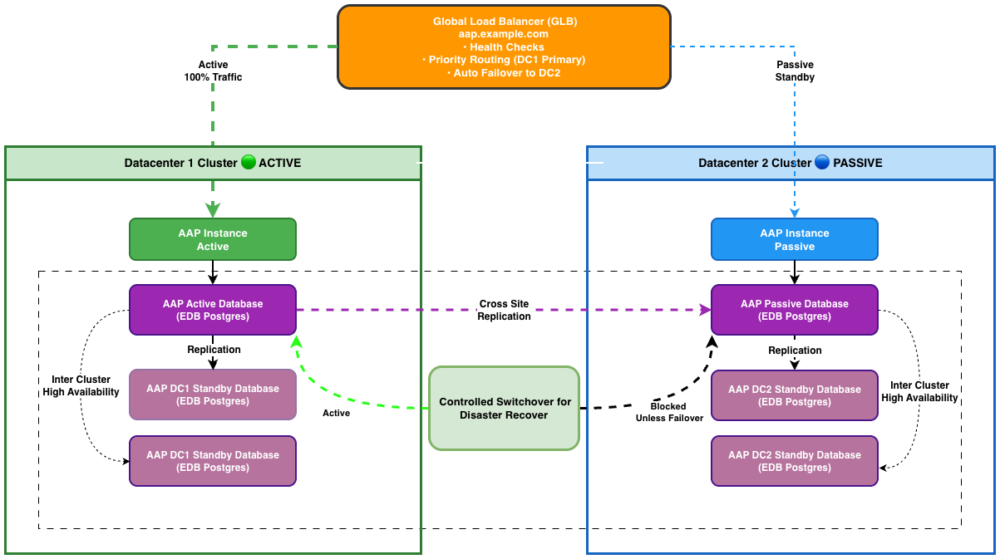

# EDB Postgres Multi-Datacenter Architecture

## Overview

This document describes the architecture of EnterpriseDB Postgres deployed across two clusters in different datacenters, with Ansible Automation Platform (AAP) providing centralized management and automation.

## Architecture Diagram



## Table of Contents

- [Architecture Diagram](#architecture-diagram)
- [Installation](#installation)
- [Component Details](#component-details)
- [EDB Postgres for Kubernetes Architecture](#edb-postgres-for-kubernetes-architecture)
- [Network Connectivity](#network-connectivity)
- [AAP Deployment Architecture](#aap-deployment-architecture)
- [AAP Cluster Management](#aap-cluster-management)
- [Ansible Automation](#ansible-automation)
- [Disaster Recovery Scenarios](#disaster-recovery-scenarios)
- [Scaling Considerations](#scaling-considerations)

## RHEL Installation

This section provides guidance for installing EDB Postgres on RHEL systems for traditional VM-based deployments, as well as EDB Postgres for Kubernetes for container-based deployments.

### Installing EDB Postgres on RHEL

For RHEL-based deployments where AAP runs as systemd services or where you need traditional PostgreSQL installations, follow the EDB installation guide.

#### Prerequisites

Before installing EDB Postgres on RHEL, ensure you have:

- **RHEL 8 or 9** system with root or sudo access
- **EDB Repository Access**: Valid EDB subscription credentials
- **Network Access**: Connection to EDB repositories
- **Minimum Resources**:
  - 2 CPU cores (4+ recommended for production)
  - 4 GB RAM (8+ GB recommended for production)
  - 50 GB disk space (more for production databases)

#### Installation Methods

Using EDB Postgres Distributed (PGD)**

For multi-datacenter replication scenarios, use EDB Postgres Distributed:

```bash
# Install PGD repository
sudo dnf install -y https://yum.enterprisedb.com/edb-repo-rpms/edb-repo-latest.noarch.rpm

# Install PGD components
sudo dnf install -y edb-pgd5

# Install PostgreSQL if not already installed
sudo dnf install -y postgresql16-server

# Initialize and configure PGD
# Follow the detailed guide at:
# https://www.enterprisedb.com/docs/pgd/latest/overview/quickstart/
```

#### Post-Installation Configuration

After installation, configure PostgreSQL for your environment:

**1. Configure PostgreSQL to Listen on Network**

```bash
# Edit postgresql.conf
sudo vi /var/lib/edb/as16/data/postgresql.conf

# Update these settings:
listen_addresses = '*'
max_connections = 500
shared_buffers = 256MB
```

**2. Configure Authentication**

```bash
# Edit pg_hba.conf
sudo vi /var/lib/edb/as16/data/pg_hba.conf

# Add entries for your network(change to your cidr):
host    all             all             10.0.0.0/8              scram-sha-256
host    all             all             192.168.0.0/16          scram-sha-256
```

**3. Restart PostgreSQL**

```bash
sudo systemctl restart edb-as-16
```

**4. Create Database Users and Databases**

```bash
# Switch to postgres user
sudo su - enterprisedb

# Connect to PostgreSQL
psql

-- Create application user
CREATE ROLE app_user WITH LOGIN PASSWORD 'secure_password';

-- Create application database
CREATE DATABASE app_db OWNER app_user;

-- Grant permissions
GRANT ALL PRIVILEGES ON DATABASE app_db TO app_user;
```

#### Firewall Configuration

```bash
# Allow PostgreSQL port (5432 or 5444 for EPAS)
sudo firewall-cmd --permanent --add-port=5432/tcp
sudo firewall-cmd --reload

# Verify
sudo firewall-cmd --list-all
```

### Installing EDB Postgres for Kubernetes

For containerized deployments on OpenShift/Kubernetes (as described in this architecture), use the EDB Postgres for Kubernetes operator.

#### Prerequisites for Kubernetes Installation

- OpenShift 4.x or Kubernetes 1.21+
- Cluster admin or namespace admin privileges
- `kubectl` or `oc` CLI installed
- Valid EDB subscription and pull secret

#### Installation Steps

**1. Install the EDB Postgres for OpenShift Operator**

```bash
# Create namespace
oc create namespace postgresql-operator-system

# Install operator via OperatorHub (OpenShift) or Helm
oc apply -f https://get.enterprisedb.io/cnp/postgresql-operator-1.23.1.yaml
```

**2. Deploy a PostgreSQL Cluster**

Create a cluster definition file:

```yaml
apiVersion: postgresql.cnpg.io/v1
kind: Cluster
metadata:
  name: postgres-cluster
  namespace: production
spec:
  instances: 3
  imageName: docker.enterprisedb.com/edb/edb-postgres-advanced:16
  
  postgresql:
    parameters:
      max_connections: "200"
      shared_buffers: "256MB"
  
  storage:
    size: 100Gi
    storageClass: gp3
  
  backup:
    barmanObjectStore:
      destinationPath: s3://my-backup-bucket/
      s3Credentials:
        accessKeyId:
          name: aws-creds
          key: ACCESS_KEY_ID
        secretAccessKey:
          name: aws-creds
          key: ACCESS_SECRET_KEY
```

Apply the cluster:

```bash
oc apply -f postgres-cluster.yaml
```

**3. Verify Installation**

```bash
# Check operator status
oc get pods -n postgresql-operator-system

# Check cluster status
oc get cluster -n production

# Check pods
oc get pods -n production
```

### Quick Start Resources

For detailed installation guides and quick start tutorials:

- **EDB Postgres Distributed Quickstart**: [https://www.enterprisedb.com/docs/pgd/latest/overview/quickstart/](https://www.enterprisedb.com/docs/pgd/latest/overview/quickstart/)
- **EDB Postgres for Kubernetes Documentation**: [https://www.enterprisedb.com/docs/postgres_for_kubernetes/latest/](https://www.enterprisedb.com/docs/postgres_for_kubernetes/latest/)
- **EDB Installation Guide**: [https://www.enterprisedb.com/docs/epas/latest/installing/](https://www.enterprisedb.com/docs/epas/latest/installing/)

### Next Steps

After installation:

1. **Configure High Availability**: Set up replication and failover (see [EDB Postgres for Kubernetes Architecture](#edb-postgres-for-kubernetes-architecture))
2. **Set Up Monitoring**: Deploy monitoring tools (Prometheus, Grafana)
3. **Configure Backups**: Set up automated backup schedules
4. **Implement Security**: Configure TLS, authentication, and network policies
5. **Deploy AAP**: Install Ansible Automation Platform for cluster management (see [AAP Deployment Architecture](#aap-deployment-architecture))

## Component Details

### Global Load Balancer

The global load balancer provides a single entry point for AAP access:

- **DNS**: `aap.example.com`
- **Type**: Active-Passive (DC1 primary, DC2 standby)
- **Health Checks**: Monitors AAP Controller availability in both datacenters
- **Failover**: Automatic failover to DC2 if DC1 becomes unavailable
- **Routing**: Priority-based routing (100% traffic to DC1 when healthy)
- **Failback**: Automatic or manual failback to DC1 when it recovers
- **Protocols**: HTTPS (port 443), WebSocket support for real-time job updates

### Ansible Automation Platform (AAP)

For OpenShift AAP is deployed on **Sepearate OpenShift clusters** for high availability and geographic distribution. For RHEL you can do a single install across datacenters however you **MUST TURN OFF THE SERVICES ON THE SECONDARY SITE**

#### Datacenter 1 - AAP Instance
- **Namespace**: `ansible-automation-platform`
- **AAP Gateway**: 3 replicas for HA
- **AAP Controller**: 3 replicas for HA
- **Automation Hub**: 2 replicas
- **Database**: PostgreSQL cluster (1 primary + 2 replicas) managed by EDB operator
- **Route**: `aap-dc1.apps.ocp1.example.com`

#### Datacenter 2 - AAP Instance (scaled down)
- **Namespace**: `ansible-automation-platform`
- **AAP Gateway**: 3 replicas for HA
- **AAP Controller**: 3 replicas for HA
- **Automation Hub**: 2 replicas  
- **Database**: PostgreSQL cluster (1 primary + 2 replicas) managed by EDB operator
- **Route**: `aap-dc2.apps.ocp2.example.com`

#### AAP Database Replication

The AAP databases are replicated from active to passive datacenter:
- **Method**: PostgreSQL logical replication (Active → Passive) - *Note: AAP's internal database uses logical replication for flexibility*
- **Direction**: DC1 (Active) → DC2 (Passive)
- **Mode**: Asynchronous replication with minimal lag
- **Shared Data**: Job templates, inventory, credentials, execution history
- **Failover**: DC2 database promoted to read-write during failover
- **Failback**: Data synchronized back to DC1 when it recovers

#### EDB-Managed PostgreSQL Cluster Replication

EDB-managed application database clusters use physical replication:
- **Method**: PostgreSQL physical replication via streaming replication and WAL shipping
- **Primary Method**: Streaming replication from Primary to Designated Primary
- **Fallback Method**: WAL shipping via S3/object store (continuous WAL archiving)
- **Within Cluster**: Hot standby replicas use streaming replication from primary/designated primary
- **Mode**: Asynchronous streaming with optional synchronous mode
- **Benefits**: Block-level replication, faster failover, exact byte-for-byte replica

## EDB Postgres for Kubernetes Architecture

### Distributed PostgreSQL Topology

This architecture implements EDB Postgres for Kubernetes (CloudNativePG) distributed topology with replica clusters across two separate Kubernetes/OpenShift clusters, as documented in the [EDB official architecture guide](https://www.enterprisedb.com/docs/postgres_for_kubernetes/latest/architecture/#deployments-across-kubernetes-clusters).

**Key Concepts:**

1. **Primary Cluster (DC1)**: 
   - Contains one primary instance accepting read/write operations
   - Contains hot standby replicas for local HA
   - Automatically managed by EDB operator within DC1

2. **Replica Cluster (DC2)**:
   - Contains a "designated primary" - a standby server in continuous recovery
   - Contains hot standby replicas cascading from designated primary
   - In read-only mode until manually promoted
   - Automatically managed by EDB operator within DC2

3. **Physical Replication**:
   - Uses PostgreSQL's native WAL-based replication
   - Primary method: Streaming replication (network-based)
   - Fallback method: WAL shipping via S3/object store
   - Byte-for-byte exact replica, faster than logical replication

4. **Automatic Service Management**:
   EDB operator automatically creates and maintains these services:
   - `<cluster>-rw`: Routes to current primary (read/write)
   - `<cluster>-ro`: Routes to hot standby replicas (read-only)
   - `<cluster>-r`: Routes to any instance (read-only)
   - During failover, operator updates `-rw` service automatically

5. **Cross-Cluster Limitations**:
   - Each EDB operator manages only its local Kubernetes cluster
   - Cross-cluster failover must be coordinated externally (via AAP, GitOps, or higher-level orchestration)
   - Promotion of replica cluster to primary is declarative but requires external trigger

### Datacenter 1 (Primary)

**OpenShift Cluster**: `ocp1.example.com`

#### Production Namespace
- **Cluster**: `prod-db` (3 instances - Primary Cluster)
  - 1 Primary Instance (read/write) + 2 Hot Standby Replicas
  - PostgreSQL 16.8
  - Auto-failover enabled within cluster
  - Continuous WAL archiving to S3/object store
  - Services automatically managed by EDB operator:
    - `-rw`: Routes to current primary (read/write)
    - `-ro`: Routes to hot standby replicas (read-only)
    - `-r`: Routes to any instance (read-only)

### Datacenter 2 (DR Site)

**OpenShift Cluster**: `ocp2.example.com`

#### Production Namespace
- **Cluster**: `prod-db-replica` (3 instances - Replica Cluster)
  - 1 Designated Primary (standby server in continuous recovery)
  - 2 Hot Standby Replicas
  - Replicated from DC1 via streaming replication and WAL shipping
  - Can be promoted to primary cluster during DR
  - Independent backup to S3
  - Services: `-ro` (read-only), `-r` (any instance read-only)

## Network Connectivity

### User to AAP (via Global Load Balancer)

Users and automation clients connect to AAP through the global load balancer:
- **URL**: `https://aap.example.com`
- **Protocol**: HTTPS/443 with WebSocket support
- **Load Balancing**: Active-Passive (priority-based)
- **Active Target**: DC1 AAP (100% traffic when healthy)
- **Passive Target**: DC2 AAP (standby, only receives traffic during failover)
- **Health Checks**: Layer 7 health checks to AAP Controller endpoints
- **Session Affinity**: Sticky sessions for long-running jobs
- **TLS Termination**: At load balancer or end-to-end encryption

### AAP to PostgreSQL Databases

Each AAP instance can connect to PostgreSQL databases in both datacenters:
- **Protocol**: PostgreSQL wire protocol (port 5432)
- **Access**: Via Kubernetes Services (ClusterIP within cluster, Routes/LoadBalancer for remote)
- **Authentication**: Certificate-based or password authentication
- **Encryption**: TLS/SSL enforced
- **Connection Pooling**: PgBouncer for efficient connection management

### Inter-Datacenter Replication

#### EDB-Managed Application Database Replication
- **Method**: PostgreSQL physical replication (streaming + WAL shipping)
- **Primary Mechanism**: Streaming replication from Primary to Designated Primary
- **Fallback Mechanism**: WAL shipping via S3/object store
- **Direction**: DC1 (Primary Cluster) → DC2 (Replica Cluster)
- **Network**: Encrypted tunnel (VPN/Direct Connect/WAN) for streaming replication
- **Replication Type**: Asynchronous (default) or synchronous (configurable)
- **Lag Monitoring**: Both AAP instances monitor replication lag via EDB operator metrics
- **Alerting**: Alerts triggered if lag exceeds threshold (e.g., 30 seconds)
- **Automatic Service Updates**: EDB operator automatically updates `-rw` service during failover
- **Cross-Cluster Limitation**: Automated failover across Kubernetes clusters must be handled externally (via AAP or higher-level orchestration)

### Write Operations (Normal State)

**For EDB-Managed Application Databases:**
1. Application → AAP Controller
2. AAP Controller → DC1 Primary Database (via `-rw` service)
3. DC1 Primary → DC1 Hot Standby Replicas (streaming replication within cluster)
4. DC1 Primary → DC2 Designated Primary (streaming replication across clusters)
5. DC1 Primary → S3/Object Store (continuous WAL archiving - fallback)
6. DC2 Designated Primary → DC2 Hot Standby Replicas (streaming replication within cluster)

### Read Operations

**EDB-Managed Clusters:**
- **DC1 Primary Cluster**: 
  - Write operations via `prod-db-rw` service (routes to primary)
  - Read operations via `prod-db-ro` service (routes to hot standby replicas)
  - Read operations via `prod-db-r` service (routes to any instance)
- **DC2 Replica Cluster**: 
  - Read operations only via `prod-db-replica-ro` service (routes to designated primary or replicas)
  - Cannot accept writes unless promoted
- **Load Balancing**: EDB operator manages service routing automatically

**Service Behavior During Failover:**
- EDB operator automatically updates `-rw` service to point to newly promoted primary
- Applications experience seamless redirection without connection string changes

### Backup Flow

**EDB-Managed PostgreSQL Backups:**
1. Scheduled backup job (initiated by AAP or CronJob via EDB operator)
2. Backup pod created by EDB operator
3. Database backup streamed to S3/object store (using Barman Cloud)
4. WAL files continuously archived to S3 (automatic by EDB operator)
5. WAL archiving serves dual purpose:
   - Point-in-time recovery (PITR)
   - Fallback replication mechanism for replica clusters
6. Replica clusters can recover from WAL archive if streaming replication fails
7. AAP monitors backup completion via operator metrics
8. Alerts sent if backup fails

**Backup Strategy per Datacenter:**
- **DC1**: Full backups + continuous WAL archiving to S3 bucket (primary region)
- **DC2**: Independent backups to separate S3 bucket (DR region) for redundancy

## AAP Deployment Architecture

### AAP on OpenShift

#### Resource Requirements

**Per Datacenter:**
- **AAP Controller**: 3 pods × (4 CPU, 8GB RAM)
- **Automation Hub**: 2 pods × (2 CPU, 4GB RAM)
- **AAP Database**: 3 pods × (2 CPU, 4GB RAM)
- **Total**: ~18 CPUs, 36GB RAM per datacenter

## AAP Cluster Management

This section covers operational procedures for managing AAP clusters in both RHEL-based and OpenShift-based deployments.

### Managing AAP on RHEL (systemctl)

For RHEL-based AAP deployments, AAP components run as systemd services. This approach is useful for traditional VM-based deployments or when running AAP outside of OpenShift.

#### AAP Service Components on RHEL

The following systemd services are typically installed:

- `automation-controller.service` - AAP Controller service
- `automation-hub.service` - Automation Hub service (if installed)
- `receptor.service` - Receptor for job execution
- `nginx.service` - Web server/reverse proxy
- `redis.service` - Redis for caching and messaging
- `postgresql.service` - PostgreSQL database (if using local DB)

#### Starting the Inactive AAP Cluster

Create a script to start all AAP services on the standby RHEL server:

**File**: `/usr/local/bin/start-aap-cluster.sh`

```bash
#!/bin/bash
#
# Start AAP Cluster Services
# This script starts all AAP components on a standby RHEL server
#

set -e

LOGFILE="/var/log/aap-startup.log"
TIMESTAMP=$(date '+%Y-%m-%d %H:%M:%S')

log_message() {
    echo "[$TIMESTAMP] $1" | tee -a "$LOGFILE"
}

log_message "Starting AAP cluster services..."

# Array of services to start in order
AAP_SERVICES=(
    "postgresql"
    "redis"
    "receptor"
    "automation-controller"
    "automation-hub"
    "nginx"
)

# Start each service and verify it's running
for service in "${AAP_SERVICES[@]}"; do
    log_message "Starting $service..."
    
    if systemctl start "$service"; then
        log_message "✓ $service started successfully"
        
        # Wait for service to be fully ready
        sleep 5
        
        if systemctl is-active --quiet "$service"; then
            log_message "✓ $service is active and running"
        else
            log_message "✗ Warning: $service may not be fully ready"
        fi
    else
        log_message "✗ Failed to start $service"
        exit 1
    fi
done

# Verify AAP Controller is responding
log_message "Verifying AAP Controller API..."
sleep 10

if curl -k -s -o /dev/null -w "%{http_code}" https://localhost/api/v2/ping/ | grep -q "200"; then
    log_message "✓ AAP Controller API is responding"
else
    log_message "✗ Warning: AAP Controller API not responding yet"
fi

log_message "AAP cluster startup complete!"
log_message "Access AAP at: https://$(hostname)/api/v2/"
```

#### Make the Script Executable

```bash
sudo chmod +x /usr/local/bin/start-aap-cluster.sh
```

#### Create Systemd Service for AAP Cluster Startup

Create a systemd service to manage AAP cluster startup:

**File**: `/etc/systemd/system/aap-cluster.service`

```ini
[Unit]
Description=Ansible Automation Platform Cluster Services
After=network.target
Wants=postgresql.service redis.service

[Service]
Type=oneshot
ExecStart=/usr/local/bin/start-aap-cluster.sh
RemainAfterExit=yes
StandardOutput=journal
StandardError=journal

[Install]
WantedBy=multi-user.target
```

#### Enable and Start the AAP Cluster Service

```bash
# Reload systemd to recognize new service
sudo systemctl daemon-reload

# Enable service to start on boot
sudo systemctl enable aap-cluster.service

# Start the AAP cluster manually
sudo systemctl start aap-cluster.service

# Check status
sudo systemctl status aap-cluster.service
```

#### Stop AAP Cluster (for maintenance)

Create a companion script to stop services:

**File**: `/usr/local/bin/stop-aap-cluster.sh`

```bash
#!/bin/bash
#
# Stop AAP Cluster Services
#

set -e

LOGFILE="/var/log/aap-shutdown.log"
TIMESTAMP=$(date '+%Y-%m-%d %H:%M:%S')

log_message() {
    echo "[$TIMESTAMP] $1" | tee -a "$LOGFILE"
}

log_message "Stopping AAP cluster services..."

# Stop services in reverse order
AAP_SERVICES=(
    "nginx"
    "automation-hub"
    "automation-controller"
    "receptor"
    "redis"
    "postgresql"
)

for service in "${AAP_SERVICES[@]}"; do
    log_message "Stopping $service..."
    systemctl stop "$service" && log_message "✓ $service stopped" || log_message "✗ Failed to stop $service"
done

log_message "AAP cluster shutdown complete!"
```

```bash
sudo chmod +x /usr/local/bin/stop-aap-cluster.sh
```

#### Manual Service Management

```bash
# Start individual services
sudo systemctl start automation-controller.service

# Stop individual services
sudo systemctl stop automation-controller.service

# Restart services
sudo systemctl restart automation-controller.service

# Check service status
sudo systemctl status automation-controller.service

# View service logs
sudo journalctl -u automation-controller.service -f

# Enable service on boot
sudo systemctl enable automation-controller.service

# Disable service on boot
sudo systemctl disable automation-controller.service
```

### Managing AAP on OpenShift (Pod Scaling)

For OpenShift-based AAP deployments, you can scale pods to zero to conserve resources in the standby datacenter, then scale them back up during failover or testing.

#### Scaling AAP Pods to Zero

**Manual Scaling:**

```bash
# Set kubeconfig for the target cluster
export KUBECONFIG=~/.kube/chadsnoconfig

# Switch to AAP namespace
oc project ansible-automation-platform

# Scale AAP Controller to 0 replicas
oc scale deployment automation-controller-operator-controller-manager --replicas=0

# Scale Automation Hub to 0 replicas
oc scale deployment automation-hub-operator-controller-manager --replicas=0

# Scale AAP Gateway to 0 replicas
oc scale deployment aap-gateway --replicas=0

# Verify all pods are scaled down
oc get pods -n ansible-automation-platform
```

#### Automated Scaling Script

Create a script to scale down all AAP components:

**File**: `scripts/scale-aap-down.sh`

```bash
#!/bin/bash
#
# Scale Down AAP Pods on OpenShift
# This script scales AAP components to zero replicas
#

set -e

# Configuration
NAMESPACE="ansible-automation-platform"
KUBECONFIG_FILE="${KUBECONFIG:-$HOME/.kube/config}"
CLUSTER_CONTEXT="${1:-api-chadsno2026-fteam-local:6443}"

echo "==================================="
echo "AAP Scale Down Script"
echo "==================================="
echo "Namespace: $NAMESPACE"
echo "Context: $CLUSTER_CONTEXT"
echo "==================================="

# Set kubeconfig
export KUBECONFIG="$KUBECONFIG_FILE"

# Switch to target context
echo "Switching to context: $CLUSTER_CONTEXT"
oc config use-context "$CLUSTER_CONTEXT" || {
    echo "Error: Failed to switch context"
    exit 1
}

# Verify current context
CURRENT_CONTEXT=$(oc config current-context)
echo "Current context: $CURRENT_CONTEXT"

# Switch to AAP namespace
echo "Switching to namespace: $NAMESPACE"
oc project "$NAMESPACE" || {
    echo "Error: Namespace $NAMESPACE not found"
    exit 1
}

# Define AAP deployments to scale down
AAP_DEPLOYMENTS=(
    "aap-gateway"
    "automation-controller-operator-controller-manager"
    "automation-controller-task"
    "automation-controller-web"
    "automation-hub-operator-controller-manager"
    "automation-hub-api"
    "automation-hub-content"
    "automation-hub-worker"
)

echo ""
echo "Scaling down AAP deployments..."
echo ""

# Scale each deployment to 0
for deployment in "${AAP_DEPLOYMENTS[@]}"; do
    if oc get deployment "$deployment" -n "$NAMESPACE" &>/dev/null; then
        echo "Scaling down: $deployment"
        oc scale deployment "$deployment" -n "$NAMESPACE" --replicas=0
        echo "✓ $deployment scaled to 0 replicas"
    else
        echo "⚠ Deployment $deployment not found, skipping..."
    fi
done

echo ""
echo "Waiting for pods to terminate..."
sleep 10

# Verify pods are scaled down
REMAINING_PODS=$(oc get pods -n "$NAMESPACE" --field-selector=status.phase=Running --no-headers 2>/dev/null | grep -E "automation|aap-gateway" | wc -l || echo 0)

if [ "$REMAINING_PODS" -eq 0 ]; then
    echo "✓ All AAP pods have been scaled down successfully"
else
    echo "⚠ Warning: $REMAINING_PODS AAP pods still running"
    echo "Remaining pods:"
    oc get pods -n "$NAMESPACE" --field-selector=status.phase=Running | grep -E "automation|aap-gateway" || true
fi

echo ""
echo "Scale down operation complete!"
echo "Database pods are NOT scaled down (intentional for replication)"
```

#### Automated Scaling Up Script

Create a script to restore AAP components:

**File**: `scripts/scale-aap-up.sh`

```bash
#!/bin/bash
#
# Scale Up AAP Pods on OpenShift
# This script restores AAP components to operational replica counts
#

set -e

# Configuration
NAMESPACE="ansible-automation-platform"
KUBECONFIG_FILE="${KUBECONFIG:-$HOME/.kube/config}"
CLUSTER_CONTEXT="${1:-api-chadsno2026-fteam-local:6443}"

echo "==================================="
echo "AAP Scale Up Script"
echo "==================================="
echo "Namespace: $NAMESPACE"
echo "Context: $CLUSTER_CONTEXT"
echo "==================================="

# Set kubeconfig
export KUBECONFIG="$KUBECONFIG_FILE"

# Switch to target context
echo "Switching to context: $CLUSTER_CONTEXT"
oc config use-context "$CLUSTER_CONTEXT" || {
    echo "Error: Failed to switch context"
    exit 1
}

# Verify current context
CURRENT_CONTEXT=$(oc config current-context)
echo "Current context: $CURRENT_CONTEXT"

# Switch to AAP namespace
echo "Switching to namespace: $NAMESPACE"
oc project "$NAMESPACE" || {
    echo "Error: Namespace $NAMESPACE not found"
    exit 1
}

# Define AAP deployments with target replica counts
# Format: "deployment:replicas"
declare -A AAP_DEPLOYMENTS=(
    ["aap-gateway"]="3"
    ["automation-controller-operator-controller-manager"]="1"
    ["automation-controller-task"]="3"
    ["automation-controller-web"]="3"
    ["automation-hub-operator-controller-manager"]="1"
    ["automation-hub-api"]="2"
    ["automation-hub-content"]="2"
    ["automation-hub-worker"]="2"
)

echo ""
echo "Scaling up AAP deployments..."
echo ""

# Scale each deployment to target replicas
for deployment in "${!AAP_DEPLOYMENTS[@]}"; do
    replicas="${AAP_DEPLOYMENTS[$deployment]}"
    
    if oc get deployment "$deployment" -n "$NAMESPACE" &>/dev/null; then
        echo "Scaling up: $deployment to $replicas replicas"
        oc scale deployment "$deployment" -n "$NAMESPACE" --replicas="$replicas"
        echo "✓ $deployment scaled to $replicas replicas"
    else
        echo "⚠ Deployment $deployment not found, skipping..."
    fi
done

echo ""
echo "Waiting for pods to start..."
sleep 15

# Wait for pods to be ready
echo "Checking pod readiness..."
MAX_WAIT=300
ELAPSED=0

while [ $ELAPSED -lt $MAX_WAIT ]; do
    READY_PODS=$(oc get pods -n "$NAMESPACE" --field-selector=status.phase=Running --no-headers 2>/dev/null | grep -E "automation|aap-gateway" | grep "1/1\|2/2\|3/3" | wc -l || echo 0)
    TOTAL_PODS=$(oc get pods -n "$NAMESPACE" --field-selector=status.phase=Running --no-headers 2>/dev/null | grep -E "automation|aap-gateway" | wc -l || echo 0)
    
    echo "Ready pods: $READY_PODS / $TOTAL_PODS"
    
    if [ "$READY_PODS" -ge 10 ]; then
        echo "✓ AAP pods are ready!"
        break
    fi
    
    sleep 10
    ELAPSED=$((ELAPSED + 10))
done

if [ $ELAPSED -ge $MAX_WAIT ]; then
    echo "⚠ Warning: Timeout waiting for pods to be ready"
fi

echo ""
echo "Current pod status:"
oc get pods -n "$NAMESPACE" | grep -E "NAME|automation|aap-gateway"

echo ""
echo "Scale up operation complete!"
echo ""
echo "Verify AAP is accessible:"
AAP_ROUTE=$(oc get route -n "$NAMESPACE" -o jsonpath='{.items[0].spec.host}' 2>/dev/null || echo "route-not-found")
echo "AAP URL: https://$AAP_ROUTE"
```

#### Make Scripts Executable

```bash
chmod +x scripts/scale-aap-down.sh
chmod +x scripts/scale-aap-up.sh
```

#### Usage Examples

**Scale down AAP in DC2:**

```bash
# Using default context
./scripts/scale-aap-down.sh

# Specifying context explicitly
./scripts/scale-aap-down.sh api-chadsno2026-fteam-local:6443
```

**Scale up AAP in DC2:**

```bash
# Using default context
./scripts/scale-aap-up.sh

# Specifying context explicitly
./scripts/scale-aap-up.sh api-chadsno2026-fteam-local:6443
```

**Verify scaling operations:**

```bash
# Check current replica counts
oc get deployments -n ansible-automation-platform

# Watch pods scaling
watch oc get pods -n ansible-automation-platform

# Check AAP route
oc get route -n ansible-automation-platform

# Test AAP API accessibility
AAP_URL=$(oc get route -n ansible-automation-platform -o jsonpath='{.items[0].spec.host}')
curl -k https://$AAP_URL/api/v2/ping/
```

#### Integration with Disaster Recovery

These scaling scripts can be integrated into disaster recovery procedures:

**Failover Scenario (DC1 → DC2):**

1. Detect DC1 failure
2. Scale up AAP pods in DC2: `./scripts/scale-aap-up.sh`
3. Promote DC2 database to read-write
4. Update global load balancer to route to DC2
5. Verify AAP is accepting connections

**Failback Scenario (DC2 → DC1):**

1. Ensure DC1 is fully recovered
2. Synchronize database from DC2 to DC1
3. Scale up AAP pods in DC1: `./scripts/scale-aap-up.sh api-crc-testing:6443`
4. Update global load balancer to route to DC1
5. Scale down AAP pods in DC2: `./scripts/scale-aap-down.sh`

#### Monitoring and Alerting

Add monitoring for scaled-down clusters:

```bash
# Check if AAP is scaled down
SCALED_DOWN=$(oc get deployments -n ansible-automation-platform -o json | \
    jq '[.items[] | select(.metadata.name | contains("automation")) | .spec.replicas] | add')

if [ "$SCALED_DOWN" -eq 0 ]; then
    echo "AAP is in standby mode (scaled to zero)"
else
    echo "AAP is active with $SCALED_DOWN total replicas"
fi
```

### Integration with EDB EFM (Enterprise Failover Manager)

EDB Failover Manager (EFM) can automatically trigger the AAP cluster management scripts during PostgreSQL database failover events. This provides seamless coordination between database failover and AAP cluster activation.

#### EFM Overview

EFM monitors PostgreSQL database clusters and automatically promotes standby nodes to primary when failures are detected. During this process, EFM can execute custom scripts at specific points in the failover lifecycle:

- **Pre-promotion**: Before promoting a standby database
- **Post-promotion**: After successfully promoting a standby to primary
- **Post-failure**: After detecting primary database failure
- **Pre-resume**: Before resuming monitoring after manual intervention

#### EFM Script Locations

EFM scripts are typically located in:

```bash
# Default EFM script directory
/etc/edb/efm-4.x/

# Custom scripts directory (configurable)
/usr/edb/efm-4.x/bin/
```

#### Integration Architecture

When EFM detects a database failure and promotes the standby:

1. **Pre-Promotion Hook**: EFM detects primary failure
2. **Post-Promotion Hook**: EFM promotes standby to primary
3. **Custom Script Execution**: EFM calls AAP scale-up script
4. **AAP Activation**: AAP cluster becomes active in DR datacenter
5. **Service Restoration**: Applications reconnect to new primary and active AAP

#### Installing Scripts for EFM Integration

**Step 1: Copy Scripts to EFM Directory**

```bash
# For OpenShift-based AAP deployments
sudo cp scripts/scale-aap-up.sh /usr/edb/efm-4.x/bin/aap-failover.sh
sudo cp scripts/scale-aap-down.sh /usr/edb/efm-4.x/bin/aap-failback.sh
sudo chmod +x /usr/edb/efm-4.x/bin/aap-failover.sh
sudo chmod +x /usr/edb/efm-4.x/bin/aap-failback.sh

# For RHEL-based AAP deployments
sudo cp scripts/start-aap-cluster.sh /usr/edb/efm-4.x/bin/aap-failover.sh
sudo cp scripts/stop-aap-cluster.sh /usr/edb/efm-4.x/bin/aap-failback.sh
sudo chmod +x /usr/edb/efm-4.x/bin/aap-failover.sh
sudo chmod +x /usr/edb/efm-4.x/bin/aap-failback.sh
```

**Step 2: Create EFM Wrapper Script**

EFM passes specific parameters to custom scripts. Create a wrapper to handle these:

**File**: `/usr/edb/efm-4.x/bin/efm-aap-failover-wrapper.sh`

```bash
#!/bin/bash
#
# EFM AAP Failover Wrapper Script
# This script is called by EFM during database failover
#
# EFM passes the following parameters:
# $1 = cluster name
# $2 = node type (primary/standby/witness)
# $3 = node address
# $4 = VIP address (if configured)
#

set -e

CLUSTER_NAME="$1"
NODE_TYPE="$2"
NODE_ADDRESS="$3"
VIP_ADDRESS="${4:-}"

LOGFILE="/var/log/efm-aap-failover.log"
TIMESTAMP=$(date '+%Y-%m-%d %H:%M:%S')

log_message() {
    echo "[$TIMESTAMP] $1" | tee -a "$LOGFILE"
}

log_message "========================================"
log_message "EFM AAP Failover Script Triggered"
log_message "========================================"
log_message "Cluster: $CLUSTER_NAME"
log_message "Node Type: $NODE_TYPE"
log_message "Node Address: $NODE_ADDRESS"
log_message "VIP Address: $VIP_ADDRESS"
log_message "========================================"

# Determine which datacenter this node is in based on address or hostname
DATACENTER=""
if [[ "$NODE_ADDRESS" == *"dc1"* ]] || [[ "$NODE_ADDRESS" == *"ocp1"* ]]; then
    DATACENTER="DC1"
    CLUSTER_CONTEXT="api-crc-testing:6443"
elif [[ "$NODE_ADDRESS" == *"dc2"* ]] || [[ "$NODE_ADDRESS" == *"ocp2"* ]]; then
    DATACENTER="DC2"
    CLUSTER_CONTEXT="api-chadsno2026-fteam-local:6443"
else
    log_message "ERROR: Unable to determine datacenter from node address"
    exit 1
fi

log_message "Detected Datacenter: $DATACENTER"
log_message "OpenShift Context: $CLUSTER_CONTEXT"

# Only scale up AAP if this node is being promoted to primary
if [ "$NODE_TYPE" = "standby" ]; then
    log_message "Node is being promoted to primary - scaling up AAP in $DATACENTER"
    
    # Check deployment type and call appropriate script
    if command -v oc &> /dev/null; then
        # OpenShift deployment
        log_message "Detected OpenShift deployment"
        /usr/edb/efm-4.x/bin/aap-failover.sh "$CLUSTER_CONTEXT"
        EXIT_CODE=$?
    else
        # RHEL deployment
        log_message "Detected RHEL deployment"
        /usr/edb/efm-4.x/bin/aap-failover.sh
        EXIT_CODE=$?
    fi
    
    if [ $EXIT_CODE -eq 0 ]; then
        log_message "✓ AAP cluster scaled up successfully in $DATACENTER"
    else
        log_message "✗ ERROR: Failed to scale up AAP cluster (exit code: $EXIT_CODE)"
        exit $EXIT_CODE
    fi
else
    log_message "Node type is $NODE_TYPE - no AAP scaling action required"
fi

log_message "EFM AAP Failover Script Completed"
log_message "========================================"

exit 0
```

**Step 3: Make Wrapper Executable**

```bash
sudo chmod +x /usr/edb/efm-4.x/bin/efm-aap-failover-wrapper.sh
sudo chown efm:efm /usr/edb/efm-4.x/bin/efm-aap-failover-wrapper.sh
```

#### Configuring EFM to Call Custom Scripts

Edit the EFM configuration file for your cluster:

**File**: `/etc/edb/efm-4.x/efm.properties`

```properties
# Post-Promotion Script (runs on newly promoted primary)
# This script activates AAP in the datacenter where database was promoted
script.post.promotion=/usr/edb/efm-4.x/bin/efm-aap-failover-wrapper.sh %h %s %a %v

# Post-Failure Script (runs after detecting primary failure)
# Optional: Use for additional logging or alerting
script.post.failure=/usr/edb/efm-4.x/bin/efm-failure-notification.sh %h %s %a %v

# Script Timeout (seconds)
# Allow sufficient time for AAP to start (300 seconds = 5 minutes)
script.timeout=300

# Enable script execution
enable.custom.scripts=true
```

**EFM Script Parameters:**

- `%h` - Cluster name
- `%s` - Node type (primary/standby/witness)
- `%a` - Node address
- `%v` - Virtual IP address (if configured)

**Step 4: Restart EFM to Apply Changes**

```bash
# Restart EFM service
sudo systemctl restart edb-efm-4.x

# Verify EFM is running
sudo systemctl status edb-efm-4.x

# Check EFM logs
sudo tail -f /var/log/efm-4.x/efm-startup.log
```

#### Testing EFM Integration

Before relying on automatic failover, test the integration:

**Test 1: Manual Script Execution**

```bash
# Test the wrapper script directly (simulate EFM call)
sudo /usr/edb/efm-4.x/bin/efm-aap-failover-wrapper.sh \
    "prod-db" \
    "standby" \
    "prod-db-replica-dc2.example.com" \
    "10.0.2.100"

# Check the logs
sudo tail -50 /var/log/efm-aap-failover.log

# Verify AAP scaled up
oc get pods -n ansible-automation-platform
```

**Test 2: EFM Test Failover**

```bash
# Perform a test failover using EFM CLI
sudo /usr/edb/efm-4.x/bin/efm promote efm-cluster -switchover

# Monitor EFM logs
sudo tail -f /var/log/efm-4.x/efm-startup.log

# Verify AAP was scaled up
oc get deployments -n ansible-automation-platform
```

**Test 3: Simulated Database Failure**

```bash
# Stop primary database (in test environment only!)
sudo systemctl stop postgresql-16

# Watch EFM detect failure and promote standby
sudo tail -f /var/log/efm-4.x/efm-startup.log

# Verify AAP activation
oc get pods -n ansible-automation-platform --watch
```

#### Advanced Configuration

**Parallel Script Execution**

For complex failover scenarios, execute multiple scripts:

**File**: `/usr/edb/efm-4.x/bin/efm-orchestrated-failover.sh`

```bash
#!/bin/bash
#
# Orchestrated Failover - Multiple Actions
#

set -e

LOGFILE="/var/log/efm-orchestrated-failover.log"

log_message() {
    echo "[$(date '+%Y-%m-%d %H:%M:%S')] $1" | tee -a "$LOGFILE"
}

log_message "Starting orchestrated failover..."

# Step 1: Update DNS (if managing DNS programmatically)
log_message "Updating DNS records..."
/usr/local/bin/update-dns-failover.sh

# Step 2: Scale up AAP cluster
log_message "Scaling up AAP cluster..."
/usr/edb/efm-4.x/bin/efm-aap-failover-wrapper.sh "$@"

# Step 3: Notify monitoring systems
log_message "Sending notifications..."
/usr/local/bin/send-failover-notification.sh "Database failover completed"

# Step 4: Update load balancer (if managing programmatically)
log_message "Updating load balancer configuration..."
/usr/local/bin/update-load-balancer.sh "dc2"

log_message "Orchestrated failover complete!"
```

**Conditional Execution Based on Time of Day**

```bash
#!/bin/bash
#
# Time-aware failover script
#

HOUR=$(date +%H)
DAY=$(date +%u)

# Only auto-scale AAP during business hours (8am-6pm, Mon-Fri)
if [ "$DAY" -le 5 ] && [ "$HOUR" -ge 8 ] && [ "$HOUR" -le 18 ]; then
    /usr/edb/efm-4.x/bin/efm-aap-failover-wrapper.sh "$@"
else
    # Outside business hours - send alert for manual intervention
    /usr/local/bin/send-alert.sh "Database failover detected outside business hours"
fi
```

#### Monitoring EFM Script Execution

Create a monitoring script to track EFM script executions:

```bash
#!/bin/bash
#
# Monitor EFM script execution
#

# Check last EFM script execution
LAST_EXECUTION=$(grep "EFM AAP Failover Script" /var/log/efm-aap-failover.log | tail -1)

if [ -n "$LAST_EXECUTION" ]; then
    echo "Last EFM failover script execution:"
    echo "$LAST_EXECUTION"
    
    # Check if execution was successful
    if grep -q "AAP cluster scaled up successfully" /var/log/efm-aap-failover.log; then
        echo "Status: SUCCESS"
        exit 0
    else
        echo "Status: FAILED"
        exit 1
    fi
else
    echo "No EFM failover script executions found"
    exit 0
fi
```

#### Troubleshooting EFM Integration

**Issue: Script Not Executing**

```bash
# Check EFM configuration
sudo cat /etc/edb/efm-4.x/efm.properties | grep script

# Verify script permissions
ls -l /usr/edb/efm-4.x/bin/efm-aap-failover-wrapper.sh

# Check EFM user has execute permissions
sudo -u efm /usr/edb/efm-4.x/bin/efm-aap-failover-wrapper.sh test test test test

# Review EFM logs for errors
sudo grep -i "script" /var/log/efm-4.x/efm-startup.log
```

**Issue: Script Timeout**

```bash
# Increase timeout in efm.properties
script.timeout=600  # Increase to 10 minutes

# Restart EFM
sudo systemctl restart edb-efm-4.x
```

**Issue: OpenShift Authentication**

```bash
# Ensure efm user has access to kubeconfig
sudo mkdir -p /var/lib/efm/.kube
sudo cp ~/.kube/chadsnoconfig /var/lib/efm/.kube/config
sudo chown -R efm:efm /var/lib/efm/.kube

# Update wrapper script to use correct kubeconfig
export KUBECONFIG=/var/lib/efm/.kube/config
```

**Issue: Network Connectivity**

```bash
# Test connectivity from efm user
sudo -u efm oc --kubeconfig=/var/lib/efm/.kube/config get nodes

# Check firewall rules
sudo firewall-cmd --list-all

# Verify DNS resolution
sudo -u efm nslookup api.chadsno2026.fteam.local
```

#### Rollback Procedures

If AAP fails to start during EFM failover:

```bash
# 1. Check what went wrong
sudo tail -100 /var/log/efm-aap-failover.log

# 2. Manually scale up AAP
./scripts/scale-aap-up.sh api-chadsno2026-fteam-local:6443

# 3. Or for RHEL deployments
sudo systemctl start aap-cluster.service

# 4. Verify AAP is operational
curl -k https://aap-dc2.apps.ocp2.example.com/api/v2/ping/

# 5. If still failing, failback to original primary
sudo /usr/edb/efm-4.x/bin/efm promote efm-cluster -switchover
```

#### Best Practices

1. **Test Regularly**: Schedule quarterly failover drills
2. **Monitor Logs**: Set up log aggregation for EFM and AAP script logs
3. **Timeout Tuning**: Allow sufficient time for AAP pods to start (5-10 minutes)
4. **Idempotency**: Ensure scripts can be run multiple times safely
5. **Error Handling**: Scripts should exit with appropriate codes (0=success, non-zero=failure)
6. **Notifications**: Send alerts when scripts execute or fail
7. **Documentation**: Keep runbooks updated with latest script versions
8. **Version Control**: Track script changes in Git
9. **Rollback Plan**: Always have manual fallback procedures
10. **Security**: Restrict script permissions to efm user only

#### Integration with AAP Job Templates

For additional automation, create AAP Job Templates that can be triggered during failover:

```bash
# Call AAP job template from EFM script
curl -k -X POST \
  -H "Content-Type: application/json" \
  -H "Authorization: Bearer $AAP_TOKEN" \
  https://aap.example.com/api/v2/job_templates/123/launch/ \
  -d '{"extra_vars": {"datacenter": "dc2", "action": "failover"}}'
```

This allows complex orchestration workflows to be managed through AAP's workflow capabilities while still being triggered by EFM during database failover events.

## Ansible Automation

In addition to the bash scripts, comprehensive Ansible automation is available through the `edb.postgres_operations` collection.

### Ansible Collection Overview

The `edb.postgres_operations` collection provides production-ready roles and playbooks for:

- **AAP Cluster Management**: Automated scaling and service management
- **EFM Integration**: Seamless integration with EDB Failover Manager
- **Disaster Recovery Orchestration**: End-to-end DR failover automation
- **Testing and Validation**: Built-in testing capabilities

### Installation

```bash
# Navigate to collections directory
cd ansible-examples/collections

# Install collection locally
ansible-galaxy collection install -p . ./ansible_collections/edb/postgres_operations

# Or build and install
cd ansible_collections/edb/postgres_operations
ansible-galaxy collection build
ansible-galaxy collection install edb-postgres_operations-*.tar.gz
```

### Ansible Roles

#### manage_aap_cluster Role

Manages AAP cluster operations for both OpenShift and RHEL deployments.

**Capabilities:**
- Scale OpenShift pods up/down
- Start/stop RHEL systemd services
- Health checks and status monitoring
- Wait for operational readiness

**Example Usage:**

```yaml
---
- name: Scale up AAP in DR datacenter
  hosts: localhost
  gather_facts: false
  roles:
    - role: edb.postgres_operations.manage_aap_cluster
      manage_aap_cluster_action: scale_up
      manage_aap_cluster_context: api-chadsno2026-fteam-local:6443
```

#### efm_integration Role

Integrates AAP cluster management with EDB Failover Manager for automated failover orchestration.

**Capabilities:**
- Install integration scripts to EFM nodes
- Configure EFM to call AAP management scripts
- Setup OpenShift kubeconfig for EFM user
- Test integration before production use

**Example Usage:**

```yaml
---
- name: Setup EFM AAP Integration
  hosts: efm_nodes
  become: true
  roles:
    - role: edb.postgres_operations.efm_integration
      efm_integration_action: install
      
    - role: edb.postgres_operations.efm_integration
      efm_integration_action: configure
```

### Ansible Playbooks

#### manage-aap-cluster.yml

General-purpose playbook for AAP cluster management operations.

```bash
# Scale up AAP
ansible-playbook edb.postgres_operations.manage-aap-cluster \
  -e 'manage_aap_cluster_action=scale_up' \
  -e 'manage_aap_cluster_context=api-chadsno2026-fteam-local:6443'

# Check status
ansible-playbook edb.postgres_operations.manage-aap-cluster \
  -e 'manage_aap_cluster_action=status'

# Start services on RHEL
ansible-playbook edb.postgres_operations.manage-aap-cluster \
  -i rhel_inventory \
  -e 'manage_aap_cluster_action=start' \
  -e 'manage_aap_cluster_deployment_type=rhel' \
  -e 'aap_require_become=true'
```

#### setup-efm-integration.yml

Complete EFM integration setup with installation, configuration, and optional testing.

```bash
# Install and configure
ansible-playbook edb.postgres_operations.setup-efm-integration \
  -i inventory \
  -l efm_nodes

# With testing
ansible-playbook edb.postgres_operations.setup-efm-integration \
  -i inventory \
  -l efm_nodes \
  -e 'run_test=true'
```

#### disaster-recovery-failover.yml

Complete disaster recovery failover orchestration with safety checks and confirmation.

```bash
# Manual failover with confirmation
ansible-playbook edb.postgres_operations.disaster-recovery-failover \
  -e 'failover_source_dc=dc1' \
  -e 'failover_target_dc=dc2'

# Automatic failover (no confirmation)
ansible-playbook edb.postgres_operations.disaster-recovery-failover \
  -e 'failover_source_dc=dc1' \
  -e 'failover_target_dc=dc2' \
  -e 'dr_failover_mode=automatic' \
  -e 'dr_require_confirmation=false'
```

### Ansible vs Bash Scripts

Both automation approaches are available:

| Feature | Bash Scripts | Ansible Automation |
|---------|-------------|-------------------|
| **Complexity** | Simple, direct | More structured |
| **Idempotency** | Manual handling | Built-in |
| **Error Handling** | Basic | Comprehensive |
| **Testing** | Manual | Built-in check mode |
| **Orchestration** | Sequential | Parallel & conditional |
| **Logging** | File-based | Ansible native |
| **Integration** | EFM-specific | Multi-tool support |
| **Best For** | EFM integration | Complex workflows |

**Recommendation:**
- Use **Bash scripts** for direct EFM integration
- Use **Ansible automation** for:
  - Complex multi-step procedures
  - Testing and validation
  - Integration with AAP workflows
  - Centralized management
  - Audit trails

### Directory Structure

```
ansible-examples/
└── collections/
    └── ansible_collections/
        └── edb/
            └── postgres_operations/
                ├── galaxy.yml
                ├── README.md
                ├── roles/
                │   ├── manage_aap_cluster/
                │   │   ├── README.md
                │   │   ├── defaults/main.yml
                │   │   ├── tasks/
                │   │   │   ├── main.yml
                │   │   │   ├── openshift_scale_up.yml
                │   │   │   ├── openshift_scale_down.yml
                │   │   │   ├── rhel_start.yml
                │   │   │   └── rhel_stop.yml
                │   │   └── meta/main.yml
                │   └── efm_integration/
                │       ├── README.md
                │       ├── defaults/main.yml
                │       ├── tasks/
                │       │   ├── main.yml
                │       │   ├── install.yml
                │       │   ├── configure.yml
                │       │   ├── test.yml
                │       │   └── uninstall.yml
                │       ├── handlers/main.yml
                │       └── meta/main.yml
                └── playbooks/
                    ├── manage-aap-cluster.yml
                    ├── setup-efm-integration.yml
                    ├── disaster-recovery-failover.yml
                    └── AAP_MANAGEMENT.md
```

### Integration with AAP Workflows

The Ansible playbooks can be integrated into AAP Workflow Templates for complete automation:

**Workflow Example: Complete DR Failover**

1. **Check Source DC Status**
   - Job Template: Check Health
   - Playbook: `check-health.yml`
   - On Failure: Continue to failover

2. **Execute Failover**
   - Job Template: DR Failover
   - Playbook: `disaster-recovery-failover.yml`
   - Extra Vars: `{ failover_source_dc: "dc1", failover_target_dc: "dc2" }`

3. **Verify Target DC Health**
   - Job Template: Verify Health
   - Playbook: `check-health.yml`
   - On Failure: Alert and rollback

4. **Update Monitoring**
   - Job Template: Update Monitoring
   - Custom playbook for your monitoring system

5. **Send Notifications**
   - Job Template: Notify Stakeholders
   - Email/Slack/PagerDuty notifications

### Testing Ansible Automation

```bash
# Test in check mode (no changes)
ansible-playbook edb.postgres_operations.disaster-recovery-failover \
  -e 'failover_source_dc=dc1' \
  -e 'failover_target_dc=dc2' \
  --check

# Test with increased verbosity
ansible-playbook edb.postgres_operations.manage-aap-cluster \
  -e 'manage_aap_cluster_action=status' \
  -vvv

# Test specific tags
ansible-playbook edb.postgres_operations.setup-efm-integration \
  -i inventory \
  -l efm_nodes \
  --tags test
```

### Documentation

Comprehensive documentation is available:

- **Collection README**: `ansible-examples/collections/ansible_collections/edb/postgres_operations/README.md`
- **AAP Management Guide**: `ansible-examples/collections/ansible_collections/edb/postgres_operations/playbooks/AAP_MANAGEMENT.md`
- **Role READMEs**: Individual README files in each role directory
- **Bash Scripts**: `scripts/README.md`

## Disaster Recovery Scenarios

### Scenario 1: Datacenter 1 Complete Failure

1. **Detection**: Global load balancer health checks fail for DC1 AAP (3 consecutive failures = 15 seconds)
2. **Traffic Shift**: GLB automatically routes all traffic to DC2 AAP instance
3. **Database Promotion**: DC2 AAP database promoted from read-only replica to read-write primary
4. **AAP Activation**: DC2 AAP takes over management of both OpenShift clusters
5. **Production Databases**: DC2 production database can be promoted if needed
6. **Recovery**: When DC1 returns:
   - Synchronize data from DC2 back to DC1
   - Rebuild replication DC1 → DC2
   - Failback to DC1 (manual or automatic)
7. **RTO**: < 1 minute (15s detection + 45s promotion/cutover)
8. **RPO**: Depends on replication lag (typically < 5 seconds)

### Scenario 2: AAP Instance Failure in DC1 (OpenShift restarts pods)

1. **Detection**: Load balancer marks DC1 AAP as unhealthy
2. **Automatic Failover**: Traffic shifted to DC2 AAP (passive becomes active)
3. **Local Recovery**: OpenShift recreates failed AAP pods in DC1
4. **Database Intact**: AAP database in DC1 remains operational, continues replication
5. **Service Restoration**: Once DC1 AAP pods are healthy and pass health checks
6. **Failback**: 
   - **Option A (Manual)**: Administrator triggers failback to DC1
   - **Option B (Automatic)**: GLB automatically fails back after DC1 stable for X minutes
7. **Impact**: Users experience brief interruption (< 15 seconds) during failover

### Scenario 3: Database Failure in DC1 (Within Cluster)

**For EDB-Managed Databases:**
1. **EDB Operator**: Detects primary PostgreSQL failure
2. **Automatic Failover**: Hot standby replica promoted to primary within DC1 cluster
3. **Service Update**: EDB operator automatically updates `-rw` service to point to new primary
4. **AAP Controller**: Reconnects to new primary automatically (via unchanged service name)
5. **Replication**: Continues to DC2 from new primary
6. **Both AAP Instances**: Continue operating normally
7. **Downtime**: < 30 seconds for database failover

**Important**: This is automatic failover within a single Kubernetes cluster. Cross-cluster failover (DC1 → DC2) requires external coordination.

### Scenario 4: Complete Network Partition

**Scenario**: DC1 and DC2 lose connectivity

1. **GLB Behavior**: 
   - If GLB can reach DC1: Continues routing to DC1 (active)
   - If GLB can reach DC2 only: Fails over to DC2
   - If both reachable but partitioned from each other: Routes to DC1 (priority)
2. **AAP Instances**: 
   - DC1 (Active): Continues normal operations
   - DC2 (Passive): Remains in standby mode (read-only database)
3. **Split-Brain Prevention**: 
   - DC2 AAP database remains read-only unless manually promoted
   - No automatic writes to DC2 database during partition
4. **Replication**: 
   - Stops during partition (DC2 falls behind)
   - Resumes when connectivity restored
   - Catch-up replication brings DC2 current
5. **Manual Intervention**: 
   - If DC1 confirmed down, manually promote DC2
   - When connectivity restored, assess and resynchronize
6. **Prevention**: Network monitoring, redundant links, and health check tuning

### Scenario 5: OpenShift Cluster Failure (DC1)

1. **AAP Impact**: DC1 AAP instance unavailable
2. **Load Balancer**: Routes all traffic to DC2 AAP
3. **DC2 AAP**: Manages DC2 OpenShift cluster, cannot manage DC1
4. **Application Failover**: Promote DC2 databases to primary
5. **Recovery**: Restore DC1 OpenShift, redeploy AAP, resync databases

### Scenario 6: Global Load Balancer Failure

1. **Direct Access**: Users access AAP directly via datacenter-specific URLs
   - `https://aap-dc1.apps.ocp1.example.com`
   - `https://aap-dc2.apps.ocp2.example.com`
2. **DNS Fallback**: Update DNS records to point to surviving datacenter
3. **AAP Continues**: Both instances operational, accept direct connections
4. **Restore LB**: Bring load balancer back online, resume normal routing

## Scaling Considerations

### Horizontal Scaling

**AAP Controller:**
```yaml
# Scale AAP controller replicas
kubectl scale deployment automation-controller \
  -n ansible-automation-platform --replicas=5
```

**PostgreSQL Clusters:**
```yaml
# Scale database replicas
kubectl patch cluster prod-db -n production \
  --type='json' -p='[{"op": "replace", "path": "/spec/instances", "value": 5}]'
```

### Vertical Scaling

**AAP Controller Resources:**
```yaml
resources:
  requests:
    cpu: "8000m"
    memory: "16Gi"
  limits:
    cpu: "16000m"
    memory: "32Gi"
```

