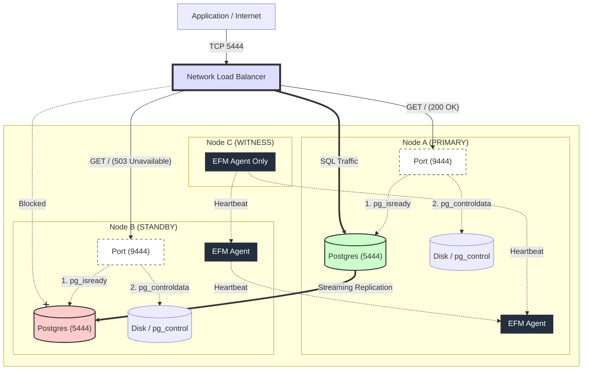

# EDB_Testing
Testing and Validation for EnterpriseDB with AAP

## Overview
This repository contains testing and validation resources for EnterpriseDB Postgres for OpenShift operator running on OpenShift clusters, with Ansible Automation Platform providing centralized management across multiple datacenters.

See [ARCHITECTURE.md](ARCHITECTURE.md) for the complete multi-datacenter architecture diagram and detailed component descriptions.

## Installation Status
✅ **EnterpriseDB Postgres for OpenShift Operator v1.28.0** - Installed and Running

See [INSTALL_SUMMARY.md](INSTALL_SUMMARY.md) for detailed installation information.

## Quick Access

### Cluster Connection
```bash
export KUBECONFIG=~/.aap/kubeconfig.microshift
```

### Check Operator Status
```bash
kubectl get pods -n postgresql-operator-system
kubectl get deployment -n postgresql-operator-system
```

### View Available PostgreSQL CRDs
```bash
kubectl get crd | grep postgresql
```

## Getting Started

Ready to create your first PostgreSQL cluster? See [GETTING_STARTED.md](GETTING_STARTED.md) for step-by-step instructions.

Quick test:
```bash
kubectl apply -f ansible-examples/oneshot-playbooks/example-postgres-cluster.yaml
kubectl get clusters -w
```

## Security

The operator runs with the default `restricted-v2` Security Context Constraint (most restrictive). No custom SCCs or elevated privileges are required. 

- **SCC**: `restricted-v2` (default, most secure)
- **UID**: `1000190000` (auto-assigned from namespace range)
- **Privilege Escalation**: Disabled
- **Root Filesystem**: Read-only

See [SECURE_INSTALL.md](SECURE_INSTALL.md) for detailed security configuration and [security-comparison.md](security-comparison.md) for the security improvements over using custom SCCs.

## Repository Structure

### 📚 Documentation (Top Level)
- **[ARCHITECTURE.md](ARCHITECTURE.md)** - Multi-datacenter architecture diagram and design
- **[INSTALL_SUMMARY.md](INSTALL_SUMMARY.md)** - Complete installation documentation and status
- **[GETTING_STARTED.md](GETTING_STARTED.md)** - Step-by-step guide for creating PostgreSQL clusters
- **[SECURE_INSTALL.md](SECURE_INSTALL.md)** - Security configuration and best practices
- **[security-comparison.md](security-comparison.md)** - Security comparison between SCC approaches

### 🤖 Ansible Automation
- **[ansible-examples/](ansible-examples/)** - Ansible automation for PostgreSQL management
  - **[README.md](ansible-examples/README.md)** - Main Ansible documentation
  - **[collections/](ansible-examples/collections/)** - Ansible collection (RECOMMENDED)
    - **[README.md](ansible-examples/collections/README.md)** - Collection quick start
    - **[GETTING_STARTED.md](ansible-examples/collections/GETTING_STARTED.md)** - Collection tutorial
    - **[SUMMARY.md](ansible-examples/collections/SUMMARY.md)** - What was created
    - **[QUICK_REFERENCE.md](ansible-examples/collections/QUICK_REFERENCE.md)** - Command reference
    - **[ansible_collections/edb/postgres_operations/](ansible-examples/collections/ansible_collections/edb/postgres_operations/)** - Collection root
      - **[galaxy.yml](ansible-examples/collections/ansible_collections/edb/postgres_operations/galaxy.yml)** - Collection metadata
      - **[README.md](ansible-examples/collections/ansible_collections/edb/postgres_operations/README.md)** - Collection documentation
      - **[CHANGELOG.md](ansible-examples/collections/ansible_collections/edb/postgres_operations/CHANGELOG.md)** - Version history
      - **[roles/](ansible-examples/collections/ansible_collections/edb/postgres_operations/roles/)** - Ansible roles
        - **deploy_cluster/** - Deploy PostgreSQL clusters
        - **execute_sql/** - Execute SQL queries
        - **check_health/** - Monitor cluster health
      - **[playbooks/](ansible-examples/collections/ansible_collections/edb/postgres_operations/playbooks/)** - Ready-to-use playbooks
    - **[examples/](ansible-examples/collections/examples/)** - Example workflows
    - **[requirements.yml](ansible-examples/collections/requirements.yml)** - Collection dependencies
    - **[ansible.cfg](ansible-examples/collections/ansible.cfg)** - Ansible configuration
    - **[inventory.yml](ansible-examples/collections/inventory.yml)** - Multi-datacenter inventory
  - **[oneshot-playbooks/](ansible-examples/oneshot-playbooks/)** - Legacy standalone playbooks
    - **[COLLECTION_MIGRATION.md](ansible-examples/oneshot-playbooks/COLLECTION_MIGRATION.md)** - Migration guide
    - **[example-postgres-cluster.yaml](ansible-examples/oneshot-playbooks/example-postgres-cluster.yaml)** - Sample cluster config
    - **deploy-postgres-cluster.yml** - Legacy deployment playbook
    - **execute-sql-query.yml** - Legacy SQL execution playbook
    - **inventory.yml** - Legacy inventory

## Architecture Overview

The following diagram illustrates the high-availability PostgreSQL setup with EDB Failover Manager (EFM) and AWS Network Load Balancer:



### Key Components

- **Node A (PRIMARY)**: Active PostgreSQL database handling all SQL traffic
- **Node B (STANDBY)**: Standby replica with streaming replication from Node A
- **Node C (WITNESS)**: EFM witness node for quorum without database instance
- **AWS NLB**: Routes traffic to healthy primary node based on health checks (port 9444)
- **EFM Agents**: Manage failover and maintain cluster quorum via heartbeats
- **Health Checks**: Sidecar processes check `pg_isready` and `pg_controldata` to determine node health
