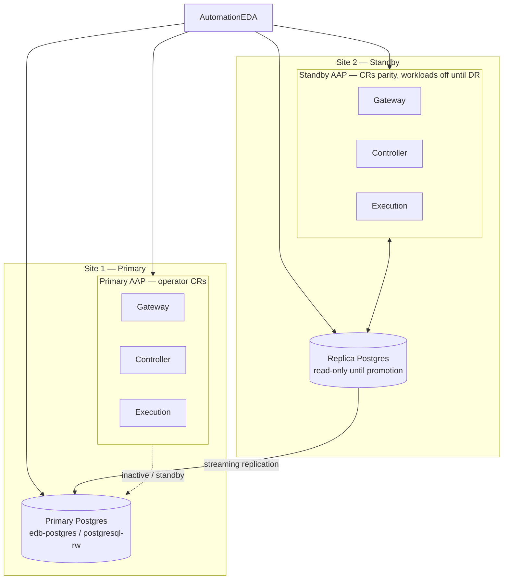

# Ansible Automation Platform — operator deployment with external EDB Postgres

This document describes how to deploy **Ansible Automation Platform (AAP)** using the **AAP Operator** with an **external PostgreSQL** database (this repo defaults to namespace **`edb-postgres`** and `Cluster` **`postgresql`**), aligned with a two-site HA/DR pattern (primary AAP + primary Postgres at Site 1; standby AAP + replica Postgres at Site 2). Use your own namespace and cluster names in production.

Related assets in this repository:

- EDB operator install: [`db-deploy/olm-openshift/`](../db-deploy/olm-openshift/), [`db-deploy/operator/`](../db-deploy/operator/)
- Sample database namespace and `Cluster`: [`db-deploy/sample-cluster/`](../db-deploy/sample-cluster/) (defaults: namespace `edb-postgres`, cluster name `postgresql`)
- Cross-cluster passive replica: [`db-deploy/cross-cluster/`](../db-deploy/cross-cluster/)
- Helper scripts to scale AAP: [`scripts/scale-aap-down.sh`](../scripts/scale-aap-down.sh), [`scripts/scale-aap-up.sh`](../scripts/scale-aap-up.sh)

Official product documentation for your AAP version (external DB requirements, CR fields, extensions) takes precedence over this guide.

### Topology (two-site DR reference)

Solid lines denote active production paths on Site 1. The dashed link is the standby relationship on Site 2 before failover; after promotion and AAP start, that link becomes the active read-write path.

---

## 1. Architecture mapping

| Concern | Implementation |
|--------|----------------|
| Primary AAP (Gateway, Controller, execution) | AAP Operator CRs on Site 1 (e.g. `AutomationController`, **Automation Gateway** CR if used, execution capacity per CR/spec) |
| Standby AAP | Same CR shapes on Site 2, **identical cryptographic secrets** as Site 1; workloads **off** or unexposed until DR |
| Primary Postgres | EDB Postgres on OpenShift `Cluster` in `edb-postgres` (e.g. `postgresql`), RW service (e.g. `postgresql-rw`) |
| Replica Postgres | Optional passive replica on Site 2 using the pattern in [`db-deploy/cross-cluster/README.md`](../db-deploy/cross-cluster/README.md); **read-only** until promotion |
| EDA | `AutomationEDA` (rulebooks) monitoring Site 1 health; expand to failover automation only after tested runbooks |

---

## 2. Prerequisites

1. **EDB Postgres on OpenShift** installed on each cluster that runs an EDB `Cluster`, with a **compatible operator version** on both sides if you use cross-cluster replication.
2. **Primary** `Cluster` healthy in `edb-postgres` (see [`db-deploy/sample-cluster/base/cluster.yaml`](../db-deploy/sample-cluster/base/cluster.yaml)); adjust storage via an overlay under [`db-deploy/sample-cluster/overlays/`](../db-deploy/sample-cluster/overlays/).
3. **AAP Operator** installed on Site 1 and Site 2; **same AAP component versions** on both sites for standby parity.
4. **Database for AAP**: create a dedicated database and role per Red Hat documentation. The sample `app` database from the sample `Cluster` bootstrap is optional; provision what AAP requires (privileges, extensions, encoding).
5. **Networking**: AAP pods must resolve and reach Postgres **read-write** endpoints during normal operation. For cross-site DR, decide whether you use a **global DNS/LB**, or **update** the Postgres connection secret after replica promotion.

---

## 3. Initial deployment — Site 1 (primary)

### 3.1 Prepare external PostgreSQL

1. Ensure your EDB `Cluster` (e.g. `postgresql` from the sample manifests, or your chosen name) is **Running** and the RW service is available inside the cluster.
2. Create the AAP database user and database; grant required privileges and install required extensions per RHAAP docs for your version.
3. If TLS is required, align `sslmode` with how clients verify the EDB server cert (see TLS notes in [`db-deploy/cross-cluster/README.md`](../db-deploy/cross-cluster/README.md) for hostname vs `verify-ca` trade-offs).

### 3.2 Create the Postgres configuration secret

Create an opaque `Secret` in the **AAP namespace** with keys expected by the AAP Operator for **unmanaged** PostgreSQL. See [`openshift/postgres-configuration-secret.example.yaml`](openshift/postgres-configuration-secret.example.yaml) for a structural template (replace all placeholders; do not commit real credentials).

Reference the secret from the **`AutomationController`** (and any other component that uses Postgres, e.g. **Automation Hub**) via:

`spec.postgres_configuration_secret: <secret-name>`

Exact CRD field names can vary slightly by AAP release; confirm in your version’s “Installing on OpenShift” / customization guide.

### 3.3 Install AAP components

1. Apply `AutomationController` (and Gateway, Hub, etc. per your design).
2. Complete routes, TLS, and resource sizing per organizational standards.
3. Validate migrations and login once pods are ready.

---

## 4. Standby site — secrets and install

### 4.1 Copy Gateway and Controller secrets

To avoid incompatible encryption keys between sites, **export** the operator-managed secrets from Site 1 that hold Gateway and Controller cryptographic material (exact names depend on resource names and AAP version). **Recreate** the same secrets on Site 2 in the AAP namespace before or immediately after applying CRs.

### 4.2 Install matching CRs on Site 2

1. Use the **same** component versions, `postgres_configuration_secret` naming strategy, and spec as Site 1 unless you intentionally differ (e.g. routes disabled).
2. After install, **do not** serve production traffic from Site 2:

   - Scale AAP deployments to zero or omit Ingress/Routes, **or**
   - Use [`scripts/scale-aap-down.sh`](../scripts/scale-aap-down.sh) with the correct namespace and kube context.

### 4.3 Database target before failover

Avoid two live AAP stacks writing to the **same** primary database. Typical patterns:

- **Cold standby CRs**: Site 2 pods off; connection secret still points at Site 1 primary (needs stable cluster networking), **or**
- Site 2 points at the **replica** only when Site 2 pods are **guaranteed off** and you accept that configuration is for DR readiness only.

Do not run both sites against one RW Postgres primary for production workloads.

---

## 5. Postgres replication (Site 1 → Site 2)

1. Expose replication from the primary cluster as required (e.g. OpenShift Route for streaming — see [`db-deploy/cross-cluster/primary-site/route-replication.yaml`](../db-deploy/cross-cluster/primary-site/route-replication.yaml)).
2. Copy TLS material and deploy the passive replica cluster using [`db-deploy/cross-cluster/scripts/sync-passive-replica.sh`](../db-deploy/cross-cluster/scripts/sync-passive-replica.sh) with `PRIMARY_CONTEXT`, `REPLICA_CONTEXT`, and `NS=edb-postgres` (defaults documented in that README).
3. Keep the replica **read-only** until a controlled promotion during DR.

---

## 6. Event-Driven Ansible (EDA)

1. Deploy `AutomationEDA` where it fits your topology (Site 2 or a third location).
2. Start with **monitoring** and alerting on primary AAP and Postgres health.
3. Add **failover** automation only after you have tested **manual** promotion and AAP startup order.

---

## 7. Failover runbook (summary)

1. **Stop all Site 1 AAP** components (scale down / stop routes) so nothing writes to the database from Site 1.
2. **Promote** the EDB replica at Site 2 to become the new primary (follow EDB “replica cluster” promotion documentation).
3. Ensure the AAP Postgres `Secret` on Site 2 references the **new read-write** endpoint (DNS or secret update).
4. **Start all Site 2 AAP** services; validate Controller, Gateway, and job execution.
5. **Optional**: rebuild streaming from old Site 1 Postgres to the new primary for future DR symmetry.

Always use explicit **`--context`** / kubeconfig when operating two clusters so changes apply to the intended API server.

---

## 8. OpenShift operator install (single cluster, external Postgres)

To install **AAP 2.6** with the operator on **one** OpenShift cluster and use **`postgresql-rw.edb-postgres.svc`** (or your cluster’s RW Service DNS name) as the database server, follow **[`openshift/README.md`](openshift/README.md)**:

1. `oc apply -k openshift/` — operator subscription in `ansible-automation-platform`
2. Run SQL on the EDB primary — `edb-bootstrap/create-aap-databases.sql`
3. `openshift/scripts/generate-postgres-secrets.sh` — create four unmanaged secrets
4. `oc apply -f openshift/ansibleautomationplatform.yaml` — parent `AnsibleAutomationPlatform` CR

Adjust `spec.hub.file_storage_storage_class` to a **ReadWriteMany** `StorageClass` before or after apply.

## 9. Layout of this folder

| Path | Purpose |
|------|---------|
| `README.md` | This deployment plan |
| `openshift/README.md` | Step-by-step operator + `AnsibleAutomationPlatform` with external Postgres (sample: `edb-postgres` / `postgresql`) |
| `openshift/` | Namespace, subscription, parent CR |
| `edb-bootstrap/create-aap-databases.sql` | Databases + `hstore` for Hub |
| `openshift/postgres-configuration-secret.example.yaml` | Single-secret structural example (placeholders only) |
