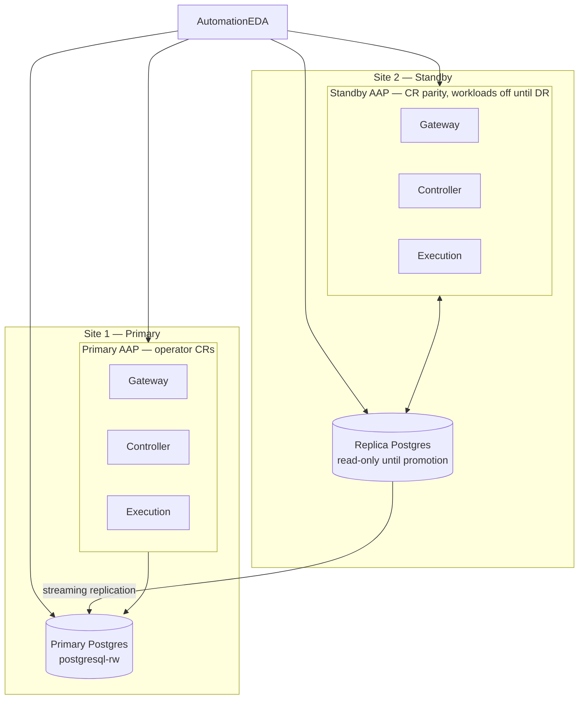

# AAP OpenShift Multi-Cluster DR Architecture
## Ansible Automation Platform 2.6 Operator with EDB PostgreSQL Active–Passive Sites

**Last Updated:** 2026-04-06  
**Version:** 1.0  
**Target RTO:** Organization-defined (manual promotion + AAP scale-up; often minutes to tens of minutes)  
**Target RPO:** Bounded by streaming replication lag and WAL retention (typical seconds–minutes; validate per network and load)  
**Based On:** Red Hat AAP 2.6 *Installing on OpenShift Container Platform* + this repository’s operator + EDB Postgres on OpenShift patterns  

> **💡 VM-based containerized topology?** See [AAP Containerized Multi-Datacenter DR Architecture](aap-containerized-enterprise-dr-architecture.md) for the Podman-on-RHEL Active–Passive reference. This document is the **OpenShift operator** counterpart.

---

## Executive Summary

This architecture describes **Ansible Automation Platform (AAP) 2.6** deployed with the **AAP Operator** on **two OpenShift clusters** in an **Active–Passive** disaster-recovery posture, aligned with [OpenShift — AAP architecture](openshift-aap-architecture.md) and the two-site plan in [`aap-deploy/README.md`](../aap-deploy/README.md).

**Key design**

- **Deployment method:** AAP 2.6 **operator** on OpenShift (`Subscription` + `AnsibleAutomationPlatform` CR), not the containerized RHEL installer.
- **Topology:** **Site 1 (active)** runs production AAP against the **read–write** PostgreSQL primary; **Site 2 (standby)** keeps **matching CRs and secrets** with AAP **workloads scaled down or unrouted** until DR.
- **Database:** **EDB PostgreSQL for Kubernetes** `Cluster` (example namespace `edb-postgres`, name `postgresql`) on each site; **cross-cluster passive replica** from Site 1 → Site 2 per [`db-deploy/cross-cluster/README.md`](../db-deploy/cross-cluster/README.md).
- **High availability:** In-cluster PostgreSQL HA via the EDB operator; **cross-site** recovery relies on **controlled promotion** of the replica and **re-pointing** AAP database secrets (or global DNS) to the new primary.
- **Automation:** **Event-Driven Ansible (`AutomationEDA`)** can monitor health; add automated failover only after **manual** runbooks are proven.

> **⚠️ Important:** Multi-cluster Active–Passive AAP with an external/unmanaged PostgreSQL topology is **customer responsibility** to validate. Red Hat documents single-cluster operator install and external DB requirements; **stretching** that across two OpenShift clusters with replication and cutover is **not** a single tested SKU. Follow PostgreSQL, EDB, and OpenShift best practices and test RTO/RPO in your environment.

---

## Table of Contents

1. [Architecture Overview](#1-architecture-overview)  
2. [Component Specifications](#2-component-specifications)  
3. [Database Replication Design](#3-database-replication-design)  
4. [OpenShift Operator Configuration](#4-openshift-operator-configuration)  
5. [Failover and Failback Procedures](#5-failover-and-failback-procedures)  
6. [Monitoring and Alerting Strategy](#6-monitoring-and-alerting-strategy)  
7. [Implementation Phases](#7-implementation-phases)  
8. [Configuration Examples](#8-configuration-examples)  
9. [Security Considerations](#9-security-considerations)  
10. [Operational Runbook Summary](#10-operational-runbook-summary)  

---

## 1. Architecture Overview

### 1.1 High-Level Architecture Diagram

```
┌─────────────────────────────────────────────────────────────────────────────┐
│                     GLOBAL LOAD BALANCER / GLOBAL DNS                        │
│           (F5 / Cloud LB / Route53 — user-facing AAP URL)                  │
│                                                                              │
│   Health checks: OpenShift Route / gateway health per site                   │
│   Active–Passive: Site1 (priority) → Site2 (standby, no prod traffic)        │
└───────────────────────────────┬─────────────────────┬──────────────────────┘
                                │ Active               │ Standby (no / DR-only)
                                ▼                      ▼
┌───────────────────────────────────────┐  ┌───────────────────────────────────────┐
│  OPENSHIFT CLUSTER — SITE 1 (ACTIVE)  │  │  OPENSHIFT CLUSTER — SITE 2 (STANDBY)   │
│                                       │  │                                         │
│  ns: ansible-automation-platform      │  │  ns: ansible-automation-platform       │
│  ┌─────────────────────────────────┐  │  │  ┌─────────────────────────────────┐   │
│  │ AnsibleAutomationPlatform CR    │  │  │  │ AnsibleAutomationPlatform CR    │   │
│  │  ├─ Gateway (Deployment)        │  │  │  │  ├─ Gateway (scaled 0 or no RT) │   │
│  │  ├─ Controller                  │  │  │  │  ├─ Controller                  │   │
│  │  ├─ Hub (RWX PVC)               │  │  │  │  ├─ Hub                         │   │
│  │  └─ AutomationEDA               │  │  │  │  └─ AutomationEDA               │   │
│  └──────────────┬──────────────────┘  │  │  └──────────────┬──────────────────┘   │
│                 │ unmanaged DB secrets│  │                 │ same secret material │
│                 ▼                     │  │                 ▼                      │
│  ns: edb-postgres                     │  │  ns: edb-postgres                      │
│  ┌─────────────────────────────────┐  │  │  ┌─────────────────────────────────┐   │
│  │ Cluster / postgresql (PRIMARY)  │  │  │  │ Cluster / postgresql-replica    │   │
│  │  Service: postgresql-rw         │  │  │  (passive replica, read-only)      │   │
│  │  + in-cluster replicas (HA)     │  │  │  until promotion                   │   │
│  └──────────────┬──────────────────┘  │  │  └──────────────┬──────────────────┘   │
│                 │                     │  │                 │                      │
│  Optional:      │                     │  │                 │                      │
│  Route TLS      │                     │  │  ◄──── streaming replication ──────────┘
│  passthrough    │                     │  │       (443 / 5432 per your design)     │
│  for replication│                     │  │       See cross-cluster README         │
└─────────────────┴─────────────────────┘  └────────────────────────────────────────┘
```

**Repository narrative (mermaid)** — same logical story as [`aap-deploy/README.md`](../aap-deploy/README.md):



### 1.2 Data Flow Architecture

**Normal operations (Site 1 active)**

```
User → GLB / external DNS → OpenShift Route (Site1) → Platform Gateway → Controller / Hub / EDA
                                                                    │
                                                                    ▼
                                          Kubernetes Service DNS: postgresql-rw.edb-postgres.svc.cluster.local
                                                                    │
                                                                    ▼
                                                          EDB Cluster PRIMARY (Site 1)
                                                                    │
                                          ┌─────────────────────────┴────────────────────────┐
                                          ▼                          ▼                       ▼
                                 In-cluster replicas          WAL / backup            Cross-cluster slot
                                          │                  (per your policy)               │
                                          │                                                  ▼
                                          │                                    Passive replica (Site 2)
                                          └──────────────────────────────────────────────────┘
```

**Failover (Site 2 active after promotion)**

```
User → GLB / DNS (cutover) → OpenShift Route (Site2) → AAP pods (Site2) → NEW RW Service / secret host
```

**Mesh / execution note (from [openshift-aap-architecture.md](openshift-aap-architecture.md)):** Keep **execution node topology consistent** across sites if you reuse mesh configuration; ad-hoc differences can cause **receptor / mesh conflicts**.

---

## 2. Component Specifications

### 2.1 AAP Operator Components (per cluster)

This repository’s default **single-cluster** install deploys **Platform Gateway**, **Automation Controller**, **Automation Hub**, and **Event-Driven Ansible** via one **`AnsibleAutomationPlatform`** instance. For DR, **Site 2** uses the **same component set and versions** with **identical cryptographic secrets** where required (Gateway/Controller); see [`aap-deploy/README.md` §4](../aap-deploy/README.md).

| Concern | Site 1 (active) | Site 2 (standby) |
|--------|------------------|------------------|
| **Parent CR** | `AnsibleAutomationPlatform` (e.g. `aap`) | Same spec shape; workloads **off** or **unexposed** |
| **Gateway** | Routed; serves UI/API | Scale to 0 or omit Route — see [`scripts/scale-aap-down.sh`](../scripts/scale-aap-down.sh) |
| **Controller** | Full replicas | Scale to 0 on standby |
| **Hub** | **RWX** `StorageClass` required | Match class; avoid two live hubs writing same DB |
| **EDA** | Active rulebooks / activations | Deploy per topology (monitoring first) |
| **Execution** | Per CR / `AutomationController` design | Parity recommended for clean DR |

**Sizing:** Follow **Red Hat AAP 2.6 OpenShift** sizing for your subscriber profile. This document does not replace vendor capacity planning.

**Naming:** Use your standard OpenShift **namespace** (example: `ansible-automation-platform`). Document **Route hostnames** per site for GLB health checks.

### 2.2 PostgreSQL (EDB on OpenShift)

| Site | Role | Implementation (this repo) |
|------|------|----------------------------|
| **Site 1** | Read–write primary | `Cluster` in `edb-postgres` (e.g. `postgresql`), Service `postgresql-rw` |
| **Site 2** | Passive replica | Separate `Cluster` (e.g. `postgresql-replica`), `spec.replica.enabled: true`, bootstrap from primary |

**AAP databases (align with bootstrap SQL)** — create on the **primary** only; replica receives them via streaming. Example names used in [`aap-deploy/edb-bootstrap/create-aap-databases.sql`](../aap-deploy/edb-bootstrap/create-aap-databases.sql) / operator docs:

- `platform_gateway` (gateway)  
- `automation_controller` (controller)  
- `automation_hub` (hub — requires **`hstore`**)  
- `automation_eda` (EDA)  

> **Note:** Confirm exact database names and extensions against **your** AAP version’s “external database” documentation.

### 2.3 Network Topology

**Typical segmentation**

```
Site 1 OpenShift:
  - Ingress / Routes:    api.<cluster>, apps.<cluster>, AAP routes
  - Pod networks:        SDN/OVN-Kubernetes CIDRs (cluster-specific)
  - Services:
      postgresql-rw.edb-postgres.svc.cluster.local  (primary RW)

Site 2 OpenShift:
  - Same structural pattern
  - Replica reaches Site 1 via **Route** or other exposed endpoint (see cross-cluster README)

WAN / peering:
  - Cluster egress → primary replication endpoint (often OpenShift **Route** with TLS passthrough)
  - Latency and bandwidth drive replication lag (RPO)
```

**Firewall / network policy (conceptual)**

| Direction | Purpose | Notes |
|-----------|---------|--------|
| Clients → Site1 Routes | HTTPS user access | GLB attaches here |
| Site1 AAP pods → `postgresql-rw:5432` | App → DB | In-cluster; restrict with `NetworkPolicy` |
| Site2 replica → Site1 replication endpoint | Streaming | Allow from replica cluster egress |
| EFM / admin | If used outside operator | Ports per [`docs/enterprisefailovermanager.md`](enterprisefailovermanager.md) |

Exact `NetworkPolicy` objects are **cluster- and CNI-specific**; implement per your security baseline.

---

## 3. Database Replication Design

### 3.1 Replication Topology

```
Site 1 — EDB Cluster (primary):
  postgresql-1 (PRIMARY RW via operator routing)
    ├─> in-cluster standby instance(s) (operator-managed)
    ├─> replication slot → Site 2 passive replica Cluster
    └─> backup / WAL archive (optional; per org)

Site 2 — EDB Cluster (replica):
  postgresql-replica-* (recovery / read-only)
    └─> promoted to primary only during controlled DR (EDB procedure)
```

### 3.2 Cross-Cluster Configuration (this repository)

1. **Expose** the primary for replication (example: [`db-deploy/cross-cluster/primary-site/route-replication.yaml`](../db-deploy/cross-cluster/primary-site/route-replication.yaml)).  
2. **TLS:** Replica often uses **`sslmode: verify-ca`** when the server cert CN/SAN does not match the Route hostname — see [TLS and the OpenShift Route](../db-deploy/cross-cluster/README.md#tls-and-the-openshift-route).  
3. **Bootstrap** the passive cluster with [`db-deploy/cross-cluster/scripts/sync-passive-replica.sh`](../db-deploy/cross-cluster/scripts/sync-passive-replica.sh) using explicit **`PRIMARY_CONTEXT`** and **`REPLICA_CONTEXT`**.  
4. Keep replica **read-only** until promotion; **never** run two AAP stacks writing the same primary.

### 3.3 Failover Manager (optional)

If you use **EDB Failover Manager** with hooks to orchestrate AAP start/stop, align with [`docs/enterprisefailovermanager.md`](enterprisefailovermanager.md) and [`scripts/efm-aap-failover-wrapper.sh`](../scripts/efm-aap-failover-wrapper.sh). On OpenShift, many teams rely on **operator-driven** Postgres failover **inside** one cluster, and **manual / scripted** promotion **across** clusters — choose one coherent model and document it.

---

## 4. OpenShift Operator Configuration

### 4.1 Site 1 — Prepare PostgreSQL and secrets

1. Install **EDB Postgres** operator and primary `Cluster` ([`db-deploy/sample-cluster/`](../db-deploy/sample-cluster/)).  
2. Run SQL bootstrap — see [`aap-deploy/openshift/README.md`](../aap-deploy/openshift/README.md) §2 and [`aap-deploy/edb-bootstrap/create-aap-databases.sql`](../aap-deploy/edb-bootstrap/create-aap-databases.sql).  
3. Generate four **opaque** secrets for unmanaged Postgres — [`aap-deploy/openshift/scripts/generate-postgres-secrets.sh`](../aap-deploy/openshift/scripts/generate-postgres-secrets.sh).  
4. Set **`spec.hub.file_storage_storage_class`** to a **ReadWriteMany** class before or after apply.

### 4.2 Site 1 — `AnsibleAutomationPlatform` CR

Apply operator subscription and instance — see [`aap-deploy/openshift/README.md`](../aap-deploy/openshift/README.md):

```bash
oc apply -k aap-deploy/openshift
# ... wait for CSV Succeeded ...
aap-deploy/openshift/scripts/generate-postgres-secrets.sh 'YOUR_PASSWORD' | oc apply -f -
oc apply -f aap-deploy/openshift/ansibleautomationplatform.yaml
```

Reference secret names from the parent CR (`spec.database.database_secret`, `spec.controller.postgres_configuration_secret`, hub and EDA fields) — template: [`aap-deploy/openshift/ansibleautomationplatform.yaml`](../aap-deploy/openshift/ansibleautomationplatform.yaml).

### 4.3 Site 2 — Secret parity and standby install

Per [`aap-deploy/README.md` §4](../aap-deploy/README.md):

1. **Export / recreate** operator-managed **Gateway and Controller** crypto secrets so Site 2 matches Site 1 (exact names depend on release).  
2. Apply **matching** `AnsibleAutomationPlatform` (or equivalent CRs) with the **same** component versions.  
3. **Do not** serve production traffic: scale down ([`scripts/scale-aap-down.sh`](../scripts/scale-aap-down.sh)) or omit Ingress/Routes.  
4. **Database target:** Avoid two writers — either secrets still point at Site 1 RW over stable connectivity, or (only with pods **off**) point at replica for rehearsed DR; see README §4.3.

### 4.4 Database endpoint strategy (DNS vs secrets)

| Pattern | When to use | Trade-off |
|---------|-------------|-----------|
| **In-cluster DNS** (`postgresql-rw.edb-postgres.svc.cluster.local`) | Single cluster; normal operation | Changes on promotion / rename |
| **Global DNS / external name** | Cross-cluster cutover | Must update TTL and point to new RW endpoint after promotion |
| **Secret update only** | Same hostname via LB in front of clusters | Operational discipline during DR |

OpenShift does **not** use the RHEL **HAProxy VM** database router from the containerized enterprise doc; **Services and Routes** (plus external GLB) fulfill that role.

---

## 5. Failover and Failback Procedures

### 5.1 Controlled failover (recommended first)

Align with [`aap-deploy/README.md` §7](../aap-deploy/README.md):

1. **Stop Site 1 AAP** (scale down / remove routes) so **no** writes originate from Site 1.  
2. **Promote** Site 2 EDB replica to primary (EDB “replica cluster” promotion procedure).  
3. **Update** AAP Postgres `Secret`(s) on Site 2 to the **new read–write** endpoint (or repoint global DNS).  
4. **Start Site 2 AAP** ([`scripts/scale-aap-up.sh`](../scripts/scale-aap-up.sh)); validate Gateway, Controller jobs, Hub, EDA.  
5. **Optional:** Re-establish replication (old primary → new primary) for symmetric DR.

Always use explicit **`oc --context`** (or kubeconfig) so commands hit the intended cluster.

### 5.2 Manual checklist (operator-specific)

| Step | Action | Verification |
|------|--------|--------------|
| 1 | Confirm Site 1 AAP scaled down | `oc get deploy -n ansible-automation-platform` |
| 2 | Confirm replication lag acceptable | EDB / `pg_stat_replication` (per your access model) |
| 3 | Promote replica | EDB docs + cluster status `Ready` |
| 4 | Patch secrets / CR if host changed | Pods roll and reconnect |
| 5 | Scale up Site 2 | Routes return 200; `/api/v2/ping/` |

### 5.3 Failback

Failback is **the same pattern in reverse** after **Site 1** is rebuilt or re-synced as a replica of the current primary. Revalidate **secrets**, **single primary**, and **GLB** priority before returning production traffic.

---

## 6. Monitoring and Alerting Strategy

### 6.1 Key metrics

| Layer | Examples |
|-------|----------|
| **OpenShift** | API server health, node readiness, PVC capacity |
| **AAP** | Pod restarts, route availability, job backlog |
| **Postgres** | `Cluster` phase, replication lag, connection saturation |
| **Cross-site** | Route to primary replication endpoint reachability |

### 6.2 Alerting

- Use **OpenShift User Workload Monitoring** or your enterprise Prometheus stack.  
- Alert on **AAP pod not ready**, **Postgres cluster not healthy**, and **sustained replication lag** above SLO.  
- Integrate with on-call (PagerDuty, etc.).

### 6.3 Health checks

- **HTTP:** Same idea as containerized doc — e.g. Controller **`/api/v2/ping/`** via Route (adjust for gateway-terminated paths).  
- **Database:** Prefer EDB operator status and monitored queries over ad-hoc `oc exec` in production.

---

## 7. Implementation Phases

### Phase 1: Platform prerequisites

- Two OpenShift clusters (versions supported by your AAP and EDB operators).  
- Image pulls, registry auth, and **RWX** storage class for Hub.  
- Network: ingress, egress to replication endpoint, optional private connectivity.

### Phase 2: Data plane

- Install EDB operator; deploy **Site 1** `Cluster`; bootstrap AAP databases + `hstore`.  
- Deploy **cross-cluster replica** on Site 2; validate streaming and lag.

### Phase 3: AAP Site 1

- Install AAP operator; apply secrets; apply `AnsibleAutomationPlatform`; complete licensing and routes per Red Hat docs.

### Phase 4: AAP Site 2 (standby)

- Replicate secrets; apply CRs; **scale down**; confirm **no** production exposure.

### Phase 5: Runbooks and testing

- Document RTO/RPO; execute **tabletop** then **technical** failover tests.  
- Add EDA automation only after manual path is stable.

### Phase 6: Production hardening

- `NetworkPolicy`, backup/restore validation, credential rotation, GLB health checks.

---

## 8. Configuration Examples

### 8.1 PostgreSQL connection (unmanaged secret keys)

Unmanaged PostgreSQL secrets for the operator carry host, port, database, user, password, and TLS mode. Generate with [`generate-postgres-secrets.sh`](../aap-deploy/openshift/scripts/generate-postgres-secrets.sh). Example **logical** content (not a committed secret):

```yaml
# Keys vary by component secret — see script output
host: postgresql-rw.edb-postgres.svc.cluster.local
port: "5432"
database: automation_controller
username: aap
password: <redacted>
sslmode: prefer
```

After DR promotion, **`host`** (or superordinate DNS) must resolve to the **new primary**.

### 8.2 Parent CR reference

Use the committed sample as a starting point:

- [`aap-deploy/openshift/ansibleautomationplatform.yaml`](../aap-deploy/openshift/ansibleautomationplatform.yaml)  
- Advanced options: [`aap-deploy/openshift/ansibleautomationplatform-advanced.yaml`](../aap-deploy/openshift/ansibleautomationplatform-advanced.yaml)  

### 8.3 Private CA for PostgreSQL TLS

If required, set **`spec.bundle_cacert_secret`** on `AnsibleAutomationPlatform` per product documentation (see [`aap-deploy/openshift/README.md`](../aap-deploy/openshift/README.md) §Private CA).

---

## 9. Security Considerations

### 9.1 Network security

- Restrict **namespace** ingress with `NetworkPolicy` (gateway only where needed).  
- Limit **egress** from `edb-postgres` to replication peers and backup targets.  
- Audit **OpenShift Route** exposure for replication endpoints.

### 9.2 TLS

- **Routes:** TLS termination vs passthrough for AAP vs Postgres replication are **separate** decisions.  
- **PostgreSQL:** Align `sslmode` with cert SAN/CN (see cross-cluster README).

### 9.3 Secrets management

- Store passwords in **OpenShift Secrets**; integrate **Vault / ESO** if required.  
- Password constraints: installer script notes **no** `'`, `"`, or `\` in DB passwords ([`openshift/README.md`](../aap-deploy/openshift/README.md)).  
- **Never** commit real credentials; use placeholders in examples only.

---

## 10. Operational Runbook Summary

Authoritative script usage: [`scripts/README.md`](../scripts/README.md). Short operational context: [`docs/manual-scripts-doc.md`](manual-scripts-doc.md).

### 10.1 Daily health check

```bash
# Site 1 — replace context and namespace with yours
oc --context site1 get cluster,ansibleautomationplatform,pods -n edb-postgres -n ansible-automation-platform
oc --context site1 get routes -n ansible-automation-platform
# Replication: use your monitoring dashboard or EDB tooling
```

### 10.2 Emergency failover (outline)

1. `scripts/scale-aap-down.sh` (Site 1) — see script for flags.  
2. Promote PostgreSQL on Site 2 (EDB).  
3. Update connection secrets / DNS for Site 2 AAP.  
4. `scripts/scale-aap-up.sh` (Site 2).  
5. Validate end-to-end automation (smoke job).

### 10.3 Common maintenance

- **Hub RWX:** PVC expansion / storage class migration per OpenShift storage docs.  
- **Upgrades:** Upgrade AAP operator and EDB operator in a **test** namespace first; maintain **version parity** across Site 1 and Site 2 CRs.  
- **DR drill:** Fail over to Site 2 on a maintenance window; measure actual RTO/RPO.

---

## Summary: RTO / RPO and scale

**RTO**

- Driven by **time to stop Site 1**, **Postgres promotion**, **secret/DNS updates**, and **AAP cold start** on Site 2.  
- Set targets with your operations team; the **< 5 minute** figures in the containerized enterprise doc assume **EFM + parallel VM startup** — OpenShift operator DR may differ.

**RPO**

- **Streaming replication lag** under WAN load; validate with production-like traffic.  
- WAL archiving (if configured) bounds **worst-case** loss; design per compliance needs.

**Infrastructure scale**

- **Not** fixed VM counts — **OpenShift node** capacity and **pod** resource requests define scale.  
- Hub **RWX** storage is mandatory for the sample Hub configuration.

---

## Related documentation

| Document | Purpose |
|----------|---------|
| [OpenShift — AAP architecture](openshift-aap-architecture.md) | Short topology summary for this repo |
| [AAP Containerized Enterprise DR](aap-containerized-enterprise-dr-architecture.md) | VM / Podman Active–Passive reference formatting |
| [`aap-deploy/README.md`](../aap-deploy/README.md) | Two-site operator + DR plan |
| [`aap-deploy/openshift/README.md`](../aap-deploy/openshift/README.md) | Single-cluster operator install steps |
| [`db-deploy/cross-cluster/README.md`](../db-deploy/cross-cluster/README.md) | Passive replica bootstrap |
| [AAP components reference](aap-components-reference.md) | Deployment verification and troubleshooting |
| [Enterprise Failover Manager](enterprisefailovermanager.md) | EFM + hooks (optional) |
| [Manual scripts / runbook](manual-scripts-doc.md) | When to scale up/down |

**External references**

- [Red Hat AAP 2.6 — Installing on OpenShift](https://docs.redhat.com/en/documentation/red_hat_ansible_automation_platform/2.6/html-single/installing_on_openshift_container_platform/index)  
- [EDB PostgreSQL for Kubernetes — Replica clusters](https://www.enterprisedb.com/docs/postgres_for_kubernetes/latest/replica_cluster/)  

---

**Document version:** 1.0  
**Next review:** 2026-07-06  
**Validation status:** Aligns with repository OpenShift + EDB patterns; **customer validation** required for production DR.
